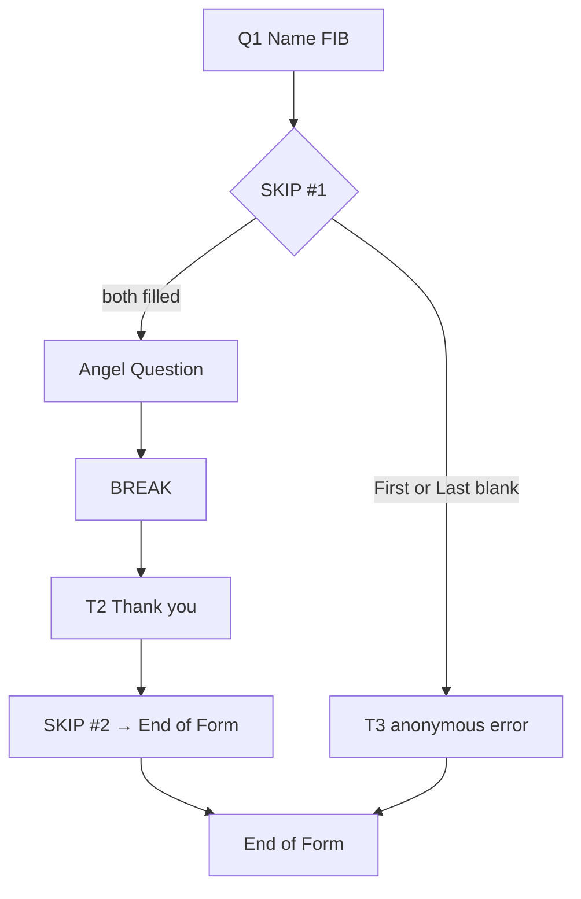

# Designer form items: Hidden Field, Page Break, Skip Instructions

Captured from legacy **Tawala Project Designer** screenshots and owner notes (June 2026). Example project: **Single Question Project** on form **Start**.

Related: `DESIGNER_MENU_SPEC.md`, `DESIGNER_FORM_ITEMS_TEXT_FIB_MCQ.md`.

---

## Hidden Field

### Owner description

- Looks **like Text** on the design canvas, except you can **drag any field** from the **Fields** panel into the box.
- **Not shown** to the end user at runtime.
- Stored data is available to the Designer for **documents** and **processes**.
- Owner has rarely used it; unsure whether values change per respondent or only via **Set** commands in processes (see source note below).

### From source (`HiddenField.cs`, `HiddenFieldView.cs`)

| Aspect | Detail |
|--------|--------|
| Canvas label | **FIELD** (dark green, italic) — not editable |
| Body | **Name:** text box (unique within form; no `:` in name) |
| Default names | `Field1`, `Field2`, … (auto-numbered across project) |
| Fields panel | Listed as `FormName:FieldName` |
| XML | `<field name="MyHiddenField"/>` |
| Runtime value | Typically assigned with **Set** in form **post-process** or inside **Skip Instructions** (acceptance test copies a FIB blank into a hidden field via `Set`) |

> **UI vs source:** Owner recalls a rich text area with drag-in references (like Text). Checked-in `HiddenFieldView` is a **name editor** only; initial/value assignment is via **Set** statements, not inline RTF. Reconcile when a second Designer build is available.

### Palette tooltip

*Add hidden field to store additional data associated with the form.*

---

## Page Break (`BREAK`)

### On canvas

| UI | Content |
|----|---------|
| Left label | **BREAK** (dark blue, italic) |
| Body | Grey **hatched** bar (50% hatch); no editable text |

### Behavior

- Visual / structural separator on the form design surface.
- Marks a **page break** at runtime (new page when form is rendered).
- No property strip; not listed in **Fields**.
- XML: `<break/>`

### Role in Skip example

In the tutorial form, a **BREAK** sits **after** the Angel Question MCQ and **before** the “Thank you” text (**T2**). It separates the question block from the closing messages — useful when the printed or paged layout should break between sections.

---

## Skip Instructions (`SKIP`)

### On canvas

| UI | Content |
|----|---------|
| Left label | **SKIP** (dark red, italic) |
| Body | NavajoWhite / peach background |
| Link | **Edit** — opens **Edit Skip Instructions** dialog |
| Summary (in link area) | Empty: *(No instructions. Click edit link on left to add instructions.)* |
| With logic | *(May skip to: T3)* or *(Skips to End of Form)* etc. |

Skip rows are **logic**, not user-visible questions. They run when the respondent **leaves** the preceding item (or at the skip point — exact runtime timing TBD).

### Edit Skip Instructions dialog

Modal titled **Edit Skip Instructions** (project name in title bar).

**Toolbar:** Cut, Copy, Paste, Delete, Undo, Redo. (Legacy chrome — Cut/Copy/Paste/Undo were never implemented and are not needed inside Skip; Delete / line controls are what matter.)

**Left — Statements palette** (subset of full Process editor):

| Button | Purpose |
|--------|---------|
| **If** | Conditional block |
| **SkipTo** | Jump to a form item or end |
| **Set** | Assign a value to a field or variable |
| **Comment** | Non-executing note |

**Main area:** Mini process editor — build statements top to bottom; blue arrow marks insertion point.

**Footer:** **Close** (saves into the skip item).

### If statement

- Header: *If **[ALL / ANY]** of the following conditions are true, execute the first set of commands:*
  - **ALL** = AND; **ANY** = OR.
- Each condition row:
  - **Field** (drag from Fields or type qualified name, e.g. `Start:First`)
  - **Operator** dropdown
  - **Value** (when operator needs one)
  - **+** / **−** to add/remove rows
- Checkbox: **Otherwise execute second set of commands** (else branch).
- **Add** ↓ commits the If block into the script.

**Operators** (string / hybrid fields — from `ComparisonOperator.cs`):

| Operator |
|----------|
| equals |
| does not equal |
| contains |
| does not contain |
| begins with |
| ends with |
| is less than |
| is less than or equal to |
| is greater than |
| is greater than or equal to |
| is blank |
| is not blank |

### SkipTo statement

- Dropdown lists **destinations on the current form**:
  - Named items: `H1`, `T1`, `Q1`, `Angel Question`, `T2`, `T3`, …
  - **End of Form**
- **Add** ↓ inserts into the active block (inside If parentheses when building conditional skip).

### Set statement

- Same as process **Set**: assign expression to a **field** (including hidden fields) or **variable**.
- Use case: copy answers into hidden storage before skipping.

### XML

Wrapped in `<skipInstructions>…</skipInstructions>` containing process lines (`<if>`, `<skip>`, `<set>`, etc.).

---

## Tutorial example: refuse MCQ without a name

**Goal:** Illustrate Skip + Break (not production style — required FIB blanks would be simpler).

### Form layout (Design tab)

| Order | Item | Purpose |
|-------|------|---------|
| 1 | **H1** — Single Question Project | Heading |
| 2 | **T1** — directions | Text |
| 3 | **Q1** — Name: First ___ Last ___ | FIB (`Start:First`, `Start:Last` in Fields) |
| 4 | **SKIP #1** | If name missing → skip to error |
| 5 | **Angel Question** | MCQ |
| 6 | **BREAK** | Page / section break |
| 7 | **T2** — Thank you… | Success path |
| 8 | **SKIP #2** | Skip error message for successful voters |
| 9 | **T3** — Sorry, we don't accept anonymous votes | Error path |

### SKIP #1 logic

```
If Start:First is blank OR Start:Last is blank
(
    SkipTo T3
)
```

Built in dialog:

1. Click **If** → set combinator to **ANY** (OR).
2. Row 1: `Start:First` **is blank**.
3. Row 2: `Start:Last` **is blank**.
4. **Add** → script shows the If block with empty body.
5. Click **SkipTo** → choose **T3** → **Add** inside the parentheses.

Canvas summary: **Edit (May skip to: T3)**.

**Effect:** Respondent who leaves first or last name blank **never sees** the Angel Question; lands on **T3**.

### SKIP #2 logic

Unconditional (or simple) **SkipTo End of Form** after **T2**.

Canvas summary: **Edit (Skips to End of Form)**.

**Effect:** Respondent who answered the MCQ and read **T2** does **not** see **T3** (error text only for the anonymous path).

### Flow diagram



---

## Browser Designer (`designer-web`) gaps

| Feature | Legacy | Browser today |
|---------|--------|----------------|
| Hidden field item | Yes | Not implemented |
| Page break | Yes | Not implemented |
| Skip instructions editor | Full If/SkipTo/Set/Comment (incl. nested If) | **Wired** (Jul 2026); Jul 19: select/Modify/delete/insert-at-arrow; **Jul 20:** re-edit keeps insert gaps; **Jul 23:** Comment autofocus; nested If in owner use — not a deferred gap. Cut/Copy/Paste/Undo toolbar icons = legacy chrome only (not TODOs). |
| Skip summary on canvas | Yes | Yes (`May skip to` / `Skips to End of Form`) |
| Form post-process Set → hidden field | Yes | Partial / JSON only |

---

## Open questions

1. **Hidden field UI:** Confirm whether any Designer build uses rich text + drag vs name-only editor.
2. **Hidden field runtime:** Default value at submit vs only post-process **Set**?
3. **Skip execution point:** Exactly when skip logic runs (on Next, on item exit, on submit).

---

## Smoke — Skip re-edit (Jul 20)

1. Build an If with then (Set + SkipTo) and Otherwise (Comment) → **Close**.
2. Open **Edit** again → click the Comment → builder shows **Modify** (edit mode).
3. Hover between lines in the If `then` block → faint insert gaps; **click** a gap inside `(` … `)` → selection clears, ▶ on that gap (**Add ↓** mode).
4. **Set** → enter field/value → **Add ↓** → statement appears in the If branch (not only Modify existing lines).
5. Alternate: with Comment still selected, click **Set** in Statements → leaves Modify → insert at current gap; move gap into If if needed, then Add.
6. **Comment focus:** Statements → **Comment** (or click an existing comment line) → caret is in the Comment text box ready to type (no extra click).

---

*Last updated: July 23, 2026 — Skip: nested If in use; Cut/Copy/Paste/Undo not TODOs.*
