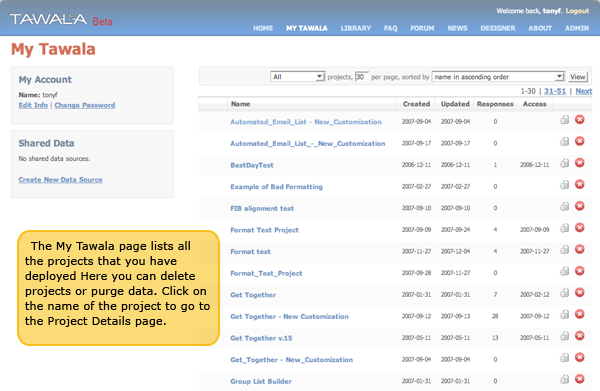
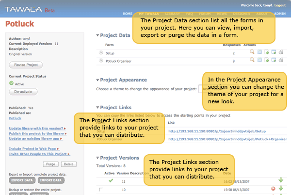
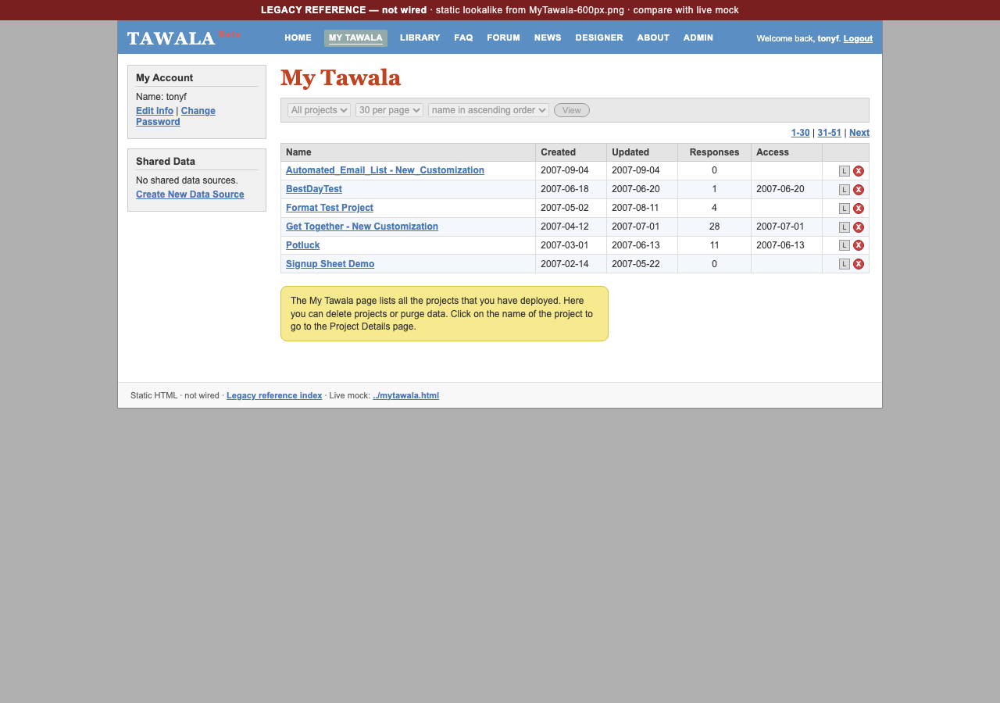
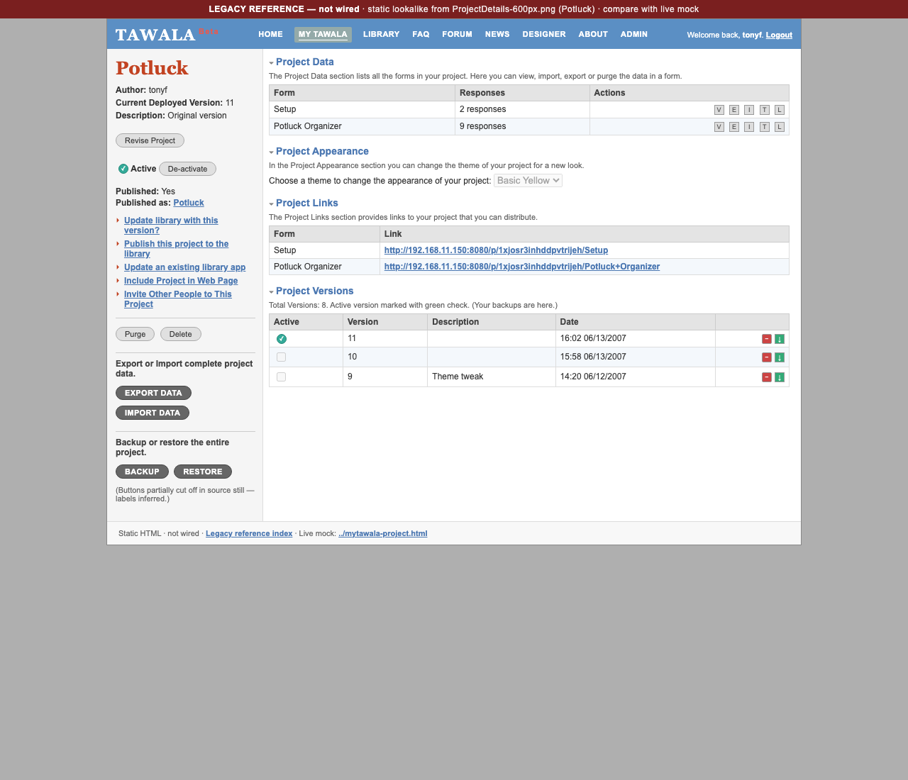
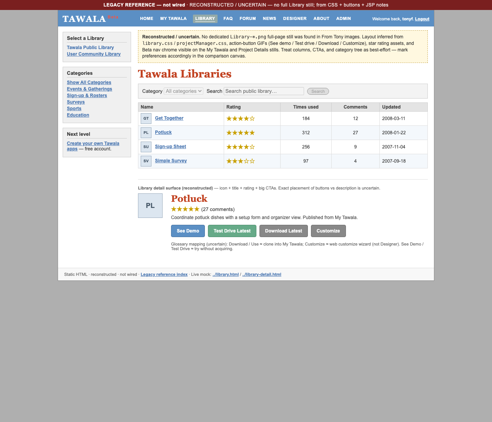

# Website mock

Static rough draft of the legacy Tawala site (home, Library, project detail, My Tawala), derived from JSP under `TawalaWebapp-build1700/web/WEB-INF/jsp/`.

**Site CSS (July 2026):** Legacy styles copied into `css/legacy/` from owner archives (`tawala-base.css`, `pages/homepage.css`, `pages/library.css`). Template images under `images/`. Mock-only chrome (banner, pending links, test-drive boxes) in `css/tawala-chrome.css`. Stub pages still use the older all-in-one `css/tawala-mock.css`.

## View locally

**Clean start tomorrow (Docker + Tomcat + :5500 + what to click):** see `docs/CHAT_HANDOFF.md` → **Chat 3 — Website mock** → **Clean start tomorrow**. Chat title: **Library thread**.

**Always** serve from `website-mock/` (not the repo root). Wrong cwd → `http://localhost:5500/library.html` returns **404**.

```bash
cd website-mock
./serve.sh                 # supervised Node static server on 127.0.0.1:5500 (auto-restarts)
# optional aliases:
./serve-watch.sh           # same as ./serve.sh
./serve.sh stop            # free the port / kill our pid
./serve.sh status          # listener + pid file
./serve.sh once            # no restart loop (debug)
```

Open:
- Home: http://localhost:5500/
- **Library:** http://localhost:5500/library.html
- My Tawala: http://localhost:5500/mytawala.html
- **Docs** (mock ops guide): http://localhost:5500/docs.html — also linked quietly from the yellow mock banner and the site footer on every chrome page; full README as plain text at http://localhost:5500/README.md
- **Legacy reference (static, non-operational):** http://localhost:5500/legacy-reference/ — Beta lookalikes of My Tawala / Project Details / Library from From Tony stills (Library = reconstructed). Side-by-side with live mock pages above. **Owner decisions:** § [Aug 9 decisions (lists 1+4)](#aug-9-decisions-lists-14) below (stills + lookalike shots under `legacy-reference/stills/`). Feature comparison canvas (outside repo): `~/.cursor/projects/Users-DougC1-Projects-Tawala/canvases/legacy-vs-mock-pages.canvas.tsx`.

**Stop:** `Ctrl+C` in the serve terminal, or from another shell: `cd website-mock && ./serve.sh stop`.

**Hardening:** `serve.sh` binds **127.0.0.1**, always uses `--directory` / `SERVE_ROOT` = this folder, prefers Node (`serve-static.mjs`, no extra deps) with Python `http.server` as fallback, kills a **stale** prior mock listener via `.serve.pid` (or a known `http.server` / `serve-static` on the port), and **restarts on crash** with backoff. Logs: `website-mock/.serve.log`. If an unknown process holds 5500: `SERVE_FORCE=1 ./serve.sh`.

**Prereq:** Java runtime on http://localhost:8080 with templates deployed. Test-drive links read from `js/demo-urls.js`.

## While you were away (Aug 1, 2026 — file cleanup / family day)

**Headline finding:** the designer-web dev API (`:3001`) was **completely broken** at the start of this session — `server/index.mjs` imported `exportProjectResponsesByUniqueId` / `importProjectResponsesByUniqueId` from `server/projectResponses.mjs`, but that file only exported differently-named functions with an incompatible shape. Node throws a hard `SyntaxError` on a missing named ES-module export, so the **whole server failed to start** — not just Export/Import, everything (Deploy, Preview, Purge, all of it). This is almost certainly why prior sessions on this track stalled. A stale Node process happened to still be listening on `:3001` from an earlier (and, on inspection, also-outdated) version of the code, which is why things may have *looked* fine if you didn't restart it — see "gotcha" below.

**What actually got fixed this session:**

1. **`designer-web/server/projectResponses.mjs`** — added the missing `exportProjectResponsesByUniqueId` / `importProjectResponsesByUniqueId` wrapper functions (grouped-by-form wire shape matching `js/data-ops.js` + `js/demo-urls.js`), with a Postgres → dev-session fallback mirroring how Purge already falls back for dev-only deploys. The dev API now starts and `/api/export-responses` + `/api/import-responses` work.
2. **`scripts/export-project-responses.sh` + `scripts/restore-project-responses.sh`** — a real second bug: the `psql` existence-check call (`psql -tAc "SELECT COUNT(*)…"`) ran *before* the real `psql -f -` script body, and both share one `docker compose exec -T` stdin pipe. Without an explicit `</dev/null` on the check, it silently drained the real SQL meant for `-f -`, so **Restore/Import silently no-op'd** — no error, `deleted` always came back `null`, and it looked like it "worked" only because re-importing the *same* data left the row count unchanged by coincidence. Fixed by redirecting every `psql` call that doesn't need the real stdin from `/dev/null`. Verified with a genuine differential test (reduce to 3 rows, confirm count drops, restore to 37, confirm it comes back) — see git history of this session or re-run the Smoke Export/Import steps below.
3. **Gotcha for next time:** `designer-web/scripts/ensure-dev-api.sh` only restarts the API when `/api/health` is **down** — a stale-but-responding process (like the one found this session) will not be replaced automatically. After pulling server-side changes, prefer a hard restart: `lsof -nP -tiTCP:3001 -sTCP:LISTEN | xargs kill; cd designer-web && ./scripts/ensure-dev-api.sh`.

**Newly wired this session (were grey stubs):**

- **Get / Refresh** (My Tawala listing bar, Aug 9 option 3; acquire Aug 10) — **Get from Library…** always on → Library picker → Save a copy. **Refresh from Library** only when a row is selected **and** linked to a Library entry (explicit `pulledFromLibraryId` or exact Library twin); runs the existing Pull metadata refresh. **Delete** still selection-gated.

**Verified solid (already wired by an earlier session, now actually confirmed working end-to-end via curl round-trips against real Postgres data, not just read from code):**

- **EXPORT / IMPORT** and **BACKUP / RESTORE** (§ "My Tawala layout" below has the full contract + smoke steps). Purge re-verified unaffected.

**Still stubbed / out of scope this session:**

- **Online/Offline** (`TAKE PROJECT ONLINE` / `TAKE PROJECT OFFLINE` sidebar buttons) — deliberately **not** wired. There's no existing "active/inactive" flag on My Tawala projects, no UI badge for it, and no defined semantics for what Offline should actually gate (block test-drive? block new submissions? just cosmetic?) — wiring it "for real" needs an owner decision, and a cosmetic-only flip felt like exactly the kind of half-done stub the owner asked to avoid. Left as a clearly-scoped next stub, not attempted.
- Everything else already parked per `.cursor/rules/tawala-designer-parked-post-website.mdc` and the README **Parked / backlog** section below (My Tawala version piles, listing UX, folders, look-and-feel polish, etc.) — untouched.

**Not touched:** Desktop, `~/Tawala Projects/` piles, any commit/push (all work in this session is uncommitted, per instructions, for owner review).

**Smoke-test this first when you're back**, in this order: (1) confirm `:3001` is running the current code — `curl -s http://localhost:3001/api/health`, and if in doubt, hard-restart per the gotcha above; (2) **Smoke Export/Import** below (the API round-trip is fastest); (3) **Smoke Purge** (must-not-break, re-verified); (4) **Smoke Pull**; (5) Backup/Restore through the actual UI (only curl-tested this session, not click-tested — Cursor's browser tool was unavailable again this session, same blocker noted in `docs/CHAT_HANDOFF.md`).

## Library vs My Tawala (split piles)

### Tenancy (product truth — owner Jul 31, 2026)

There is **one public Library** (shared catalog). Each **account** has its **own separate, private My Tawala**; another account cannot see or access your My Tawala contents. The bridge out of private My Tawala into the public world is **Publish** (to Library) — optional and deliberate. Until Publish, projects stay private to that account’s My Tawala.

**Current priority (owner Jul 31, 2026):** **Libraries are the core of the Website** (Library + My Tawala / catalog ops). Harden **Delete / Purge** and data/backup lifecycle ops (**EXPORT / IMPORT**, **BACKUP / RESTORE**) over look-and-feel; solid basis for libraries already exists. Library → My Tawala **Save a copy** is wired (rename-on-acquire); **Use** (run start link) is on My Tawala. **Do not** chase more visual polish now — **Home** L&F is optional and non-critical. Version piles stay deferred until ops are trustworthy (see glossary **Sequencing / hold** below).

**Mock note:** today’s mock is single-browser `localStorage` (no real multi-account auth). The **product model** is still multi-account private My Tawala; do not design as if all My Tawala piles were shared.

Owner working copies live outside the repo under `~/Projects/Tawala Projects/`. Repo backups:

| Role | Owner folder | Repo backup | Catalog in `js/demo-urls.js` |
|------|--------------|-------------|------------------------------|
| Public Library / try-outs | `WebLibrary/` | `projects/library/` | `TAWALA_LIBRARY` |
| Personal My Tawala | `MyTawala/` | `projects/mytawala/` (archives / Edit-in-Designer JSON only) | `TAWALA_MYTAWALA` (**empty seed** — listing = Push + Save a copy overlays) |

See `projects/README.md` for refresh commands and MANIFEST files.

**Display names:** Listing/detail titles never show `.json` / `.JSON` (or legacy `.tawala`). On disk, Designer project files are JSON today; legacy `.tawala` was the C# XML project format (still openable/convertible in Designer). Mock UI uses the human project name only — `jsonFile` paths are maintainer metadata in `demo-urls.js`, not shown to end users.

**Product rules (mock):**

- **My Tawala is not a fake catalog.** It shows the user’s real projects only: Designer **Push / Show in My Tawala**, Library **Save a copy** (including **Get from Library…**), and **Make a Copy** (own fork). `TAWALA_MYTAWALA` seed is **empty** (Aug 10, 2026) — converted-backup / archive stubs and the fake Online Exam My Tawala seed were removed. JSON under `projects/mytawala/` may remain on disk; do not re-seed undeployed stubs into the listing. Listing blue **from Library** chip shows only on the acquire’s **local calendar day** (same date as `createdAt` / `created`); Details sidebar Source stays forever. Hard-refresh: `http://localhost:5500/mytawala.html?v=20260810-vercol1`
- **Always use `http://localhost:5500`** (not `127.0.0.1`) for review — same server (`serve.sh` binds 127.0.0.1, reachable as either), but browsers treat `localhost` vs `127.0.0.1` as **different origins → separate localStorage**. Owner projects live on **localhost**. Designer **Show in My Tawala** opens localhost so Push merges into the same overlay. If a tab on `127.0.0.1:5500` looks empty, switch to localhost (yellow banner on 127.0.0.1 links there). DevTools → Application → Local Storage for both origins (`tawala.mock.myTawalaOverlay`).
- **Rename ≠ Make a Copy.** **Rename** only changes the display name of the **same** project (Details + listing). **Make a Copy** mints a **new** My Tawala identity (new overlay id + name dialog with overwrite warn; original untouched; **empty response data** — `uniqueId: null`, label-only starts, `deployed: false`; **Use** grey until Push → Show in My Tawala). Does **not** share the source’s live `:8080` uniqueId (that leaked picnic/Library submissions onto forks). Controls on Project Details (next to Rename) **and** My Tawala listing bar when a row is selected. ≠ Library **Save a copy** (acquire from public catalog).
- **My Tawala** lists only the MyTawala pile — never the Library / starter catalog as “my” projects.
- **Library** does **not** list Designer-only New Project basics (Empty/Blank, Form with Process, Form with Process & Document). Those stay File → New Project in the Designer.
- Library **listing** is dense like My Tawala (name + stars inline / times used / updated / row actions); descriptions and **comments** live on the detail page (comments stub on Project Details — not a list column).
- Categories are **collapsible groups** mirroring Designer **File → New Project** (Activities, Meetings and Gatherings, Polls and Surveys) plus WebLibrary extras (Sports, Business, Entertainment, Advanced). Designer-only **Basic** templates are never listed.
- **`liveReady: true`** in `demo-urls.js` = owner-vetted product with a working `:8080` test-drive. Library list shows a quiet green **Live** chip (placeholders stay unmarked; Test drive stays disabled until `deployed` + URL).
- List rows are **name-only** (no letter-tile icon fallbacks — those were CSS stand-ins for missing project icon bitmaps). Missing `:8080` deploys are **not** bannered on list chrome — Test drive stays disabled with a title tip; quiet status may appear on detail / start-point stubs only. Listing titles never show a `.json` extension — on-disk backups may still be JSON; display uses the project name only.

### Library vs New Project templates (owner Aug 10, 2026)

**Source of good starters:** Designer **File → New Project…** — catalog in `designer-web/src/templates/catalog.ts`, JSON under `designer-web/public/samples/templates/` (Empty, Form with Process, Form+Process+Document, Sign-up Sheet, Sign-up Sheet w Email, Get Together, Potluck, Simple Survey, Multiple Question Survey). Spec/matrix: `Tawala_Key_Documents/DESIGNER_TEMPLATE_MATRIX.md`.

**Public Library (`TAWALA_LIBRARY` in `js/demo-urls.js`)** is only for **vetted liveReady try-outs** with working `:8080` URLs — not a dump of New Project JSON or WebLibrary conversions. Aug 10 cleanup:

- Removed broken **Sign-up Sheet Template** Library seed (`signup-sheet` → old uniqueId `cicw55xxhvwrrh7`). Sign-up Sheet stays on **New Project** only until a good Deploy is re-Published.
- Removed all remaining **WebLibrary stubs** from the catalog seed (do not reintroduce). Backing JSON under `projects/library/` may still exist on disk as archives; they are not listed.
- Kept liveReady: Simple Survey, Potluck, Get Together, Multiple Question Survey, Horses and Penguins Test, Online Exam Builder.
- **Sign-up Sheet w Email** already retired Aug 1 (New Project only).

**If Library / My Tawala still shows Sign-up Sheet after the repo cleanup:** that is almost always this browser’s `localStorage` (Save a copy / Publish overlay / old Test Drive uniqueId `cicw55xxhvwrrh7`) — not the seed. Open once (auto-runs): `http://localhost:5500/_diag-discard-signup-copy.html` — then hard-refresh Library and My Tawala. Designer **New Project → Sign-up Sheet** is intentionally kept.

**If Library still shows WebLibrary stubs (AlexTimon, DirtBowl, …) after seed cleanup:** root cause is almost always `tawala.mock.libraryOverlay` — **Save a copy** (and admin Rename) used to snapshot the full catalog row into localStorage, so stubs survived after they were removed from `TAWALA_LIBRARY`. Fix is in `transfer.js` (denylist scrub on every Library load + no more full-row snapshot on Save a copy).

- **Hard-refresh Library (must show 6 liveReady only, no stubs):**  
  `http://localhost:5500/library.html?v=20260810-stubs-gone2`
- **Nuclear overlay clear (if stubs still appear):**  
  `http://localhost:5500/_diag-clear-library-stubs.html`  
  (or `…/_diag-clear-library-stubs.html?nuke=all` to wipe all Library Publish overlays)

### Library Actions / Use framing (owner Aug 1, 2026)

**Product split (implemented in mock):** Library = discovery / acquire; My Tawala = operate. Library Actions are **Test drive** (with **Times used** metric) | **Copy link** (with **Copies downloaded** metric) | **Copy to MyTawala** (logged-in only; hidden for guests; copies the project, not Library Test Drive answers) — **no Use** on Library. Public **Library Project Details** pages are **retired** (Aug 10) — listing is enough; multi-start uses the hot-link picker. **Copy link** copies the same live `:8080` URL Test Drive opens (viral share; no account). **Use** lives on **My Tawala** (listing icon + Project Details **USE**): **single start point** → opens that `:8080` URL; **multiple start points** (e.g. Online Exam Setup + Exam) → navigates to **Project Details** so the user chooses an entry point (does **not** jump straight to Exam). Grey when no deploy URL. Does **not** purge-on-start (unlike Library Test drive). This is **not** legacy CloneAndCustomize / web customize — that path stays deferred (Sophisticated in-project customize vs retire).

**Guest taste (Aug 10):** Top-nav **MY TAWALA** while in **guest mode** (after Logout) opens `mytawala-demo.html` — canned sample portfolio; row → inert Details. Mock defaults to **logged in as `dev`** (same as before) so you are not locked out of real My Tawala. **Logout** sets guest mode; **Login** / `_unlock-mytawala.html` clears it. Library **Copy to MyTawala** is hidden only in guest mode. Not Auth Task #21.

**Locked out?** Open http://localhost:5500/_unlock-mytawala.html or http://localhost:5500/login.html?v=20260810-login2 and click **Log in as dev**.

**Background:** Most users are not comfortable with Designer. Some projects cannot really be used without going through Designer first (e.g. **Sign-up Sheet Template w Email** — customize in Designer); those belong on **Designer → File → New Project**, not the public Library (retired from catalog Aug 1, 2026). The alternative path is versions customizable entirely from within the Project (no Designer) — historically **"Sophisticated"**. Users who will not pull into Designer may just want a **copy in My Tawala to run**, then **Use** from My Tawala.

**Implications:**

- Library should prefer **runnable / admin-from-runtime** projects, or clearly label **Designer-required** starters.
- Designer-only starters stay on the New Project menu; `signup-sheet` and `signup-sheet-email` are no longer in `TAWALA_LIBRARY` (Aug 10 / Aug 1).
- Glossary: **Use** (My Tawala — single-start run link, or Project Details with starts expanded + first start selected when multi-entry) ≠ **Copy to MyTawala** (Library → My Tawala; project only, not Test Drive answers; requires login) ≠ **open in Designer** ≠ legacy **USE IT** / CloneAndCustomize (not wired).
- Aligns with tenancy: **Publish** to Library; **operate** from My Tawala.
- **Owner evidence (Aug 1, 2026):** *“Every year the sports leagues asked how to move over rosters from previous years so they wouldn't have to re-enter all that data.”* **Refinement:** leagues **exported via Excel** at end of season and **archived** it; they only **reused player data**, stripping graduates and adding new kids. Season handoff ≈ **Export (Excel) archive + selective Import/reuse of a roster subset** — not full **Backup/Restore** of everything, not delete-and-re-pull Library. Aligns with the documented **EXPORT/IMPORT** data spine (Excel). Soft open: a future “roll season” could mean export-archive + import filtered roster. Reinforces **named long-lived instances + cross-season data move**; distinct from Designer Customize vs Copy to My Tawala. (Parked — no feature invented here; see Parked / backlog.)

### Library quality / community (owner Aug 1, 2026 — open questions; L&F / later product)

**Parked — framing only; do not build ratings, reputation, or community-moderation wiring now.** Same sequencing as other look-and-feel / later-product ideas: **Library / catalog ops first**; this is not initial Publish wiring.

**Owner thoughts (open):**

- There is a real difference between **professionally developed** projects and **amateur** / community-shared ideas.
- Value in people sharing ideas — but hard to mix that with **very complex** projects (e.g. SportsDashboards / DirtBowl class) that required professional design.
- Possible: **reviews and ratings** gradually promote the best products to the top.
- Caution: **reputation systems are easy to game** — uncertain how well that works in practice.
- Analogy: YouTube — much of what worked was making it **really easy to load content**; for Tawala, **Designer would need to get a lot easier** for community contribution to work well.

**Open questions (not decided):** How (or whether) to surface pro vs community projects in one Library; whether ratings/reviews are worth the gameability risk; how much Designer ease-of-use is a prerequisite for a healthy publish culture. Keep today’s mock stars / comments as stubs only — no reputation product work in this phase. See also Parked / backlog.

### Library stubs (retired from catalog seed — Aug 10, 2026)

Owner cleared stubs from the Public Library experience; the **repo seed** now matches: **`TAWALA_LIBRARY` has 0 stubs** (confirmed via `node scripts/list-library-stubs.mjs`). Do **not** re-seed WebLibrary placeholders into the catalog. JSON under `projects/library/` may remain as archives only.

**How a stub used to be identified:** `stub: true` + `" (stub)"` name suffix. **Policy now:** only add Library rows that are owner-vetted `liveReady` with real `:8080` Test Drive URLs — preferably after Designer New Project → **Push** → My Tawala Details **PUBLISH**. New Project templates that are not ready for Library stay on Designer only (Sign-up Sheet / Sign-up Sheet w Email).

**Why stubs could still appear after seed cleanup:** `Save a copy` / admin Rename wrote full catalog rows into `tawala.mock.libraryOverlay`. Removing stubs from `demo-urls.js` did not clear that overlay, so `withLibraryOverlay` re-added them. Fixed Aug 10: denylist + auto-scrub + thin cloneCount overlay. Confirmation URLs above.

```bash
cd website-mock && node scripts/list-library-stubs.mjs   # should print 0 stubs
```

**Admin / overlay note:** `library-admin.html` Retire still works for *this browser’s* overlay if a Publish overlay reappears locally; shipping catalog changes still go through `js/demo-urls.js`.

## Navigation and stub pages

Shared chrome lives in `js/chrome.js` (header, footer, guest/logged-in status via `tawala.mock.session`).

| Page | File |
|------|------|
| Home | `index.html` |
| Library | `library.html` |
| Project detail (Library) | **Retired** — `library-detail.html` redirects to `library.html?highlight=…` |
| My Tawala — My Projects | `mytawala.html` (requires mock login; guests redirect to demo) |
| My Tawala — Project Details | `mytawala-project.html?project=…` (requires mock login) |
| My Tawala — guest preview | `mytawala-demo.html` / `mytawala-demo-project.html` (static snapshots under `images/guest/`) |
| Library admin tools (maintainer, gated) | `library-admin.html` (see § Library admin path) |
| Ops archive review | `project-ops-review.html` |
| **Docs** (curated mock ops HTML) | `docs.html` — linked from mock banner + footer; also `README.md` via static server |
| About / Company Info | `about.html` |
| FAQ | `faq.html` |
| Login | `login.html` (sets mock session) |
| Sign up | `signup.html` |
| Logout | `logout.html` (clears mock session) |
| Designer | `designer.html` |
| Terms | `terms.html` |
| Privacy | `privacy.html` |

Links **without** a stub yet are greyed out via class `link-pending` in `chrome.js` (`ready: false`). Add a stub HTML file and set `ready: true` to enable the link.

## Symbiotic hops (Designer ↔ mock)

| From | To |
|------|-----|
| Mock chrome banner / My Tawala sidebar | Web Designer `http://localhost:5173` |
| Designer **Project → Project Manager…** (or toolbar) | `mytawala-project.html?project=…` for the open project name (slug id) |
| Designer **Help → Website mock (My Tawala)…** | `http://localhost:5500/mytawala.html` |
| Designer **Help → Website mock (Library)…** | `http://localhost:5500/library.html` |
| Designer **Push** dialog (UI still **Deploy**) → **Show in My Tawala** | `mytawala-project.html?project=…&deployReceipt=…` — upserts My Tawala pile overlay + opens Details |

Test-drive start points stay on `:8080` via `js/demo-urls.js`.

### Transfer flows (scaffold)

Shared helpers: `js/transfer.js` (localStorage on `:5500` only — Designer `:5173` does not share storage).

| Hop | UI | Status |
|-----|-----|--------|
| **Web Designer → My Tawala** | Designer **Push** dialog **Show in My Tawala**; My Tawala **From Web Designer** inbox | Wired — receipt upserts `localStorage` overlay into My Projects pile + opens Project Details. Overlay survives reload until **Delete** (or clear). Not written into `demo-urls.js`. Listing **Push from Designer** chrome **retired Aug 25 (#18)** — authors hop via Details **Edit project in Designer**, then Push there. |
| **Library → My Tawala** | Listing / detail **Copy to MyTawala** | Wired (Aug 9 #8; private uniqueId Aug 24 #26) — rename dialog → Push catalog JSON as a **new** Tomcat identity → My Tawala overlay (`pulledFromLibraryId`, own uniqueId, empty Records). Edit in Designer uses the clone snapshot. |
| **My Tawala → Library** | Project Details **PUBLISH** | Wired (Aug 1, 2026) — opens the Publish dialog. Listing Publish removed Aug 9 (lean list). Listing-sidebar **Publish to Library** grey stub **retired Aug 25 (#18)** — use Details **PUBLISH** or library-admin. |
| **Library → My Tawala acquire** | Listing **GET FROM LIBRARY…** | Wired (Aug 10 acquire picker) — opens a Library project picker → same **Save a copy** rename flow → lands on **My Tawala listing** with the new row highlighted (`?highlight=`). Not a nav duplicate of Library. |
| **Library ← My Tawala upgrade** | Listing **REFRESH FROM LIBRARY** | Wired (Aug 1, 2026; renamed/gated Aug 9 option 3) — enabled only when a selected My Tawala row is **linked** to a Library entry (`pulledFromLibraryId` or exact id/name twin); dialog + `TawalaTransfer.pullFromLibrary` refreshes description/category/reference start points. Listing-sidebar **Pull from Library** grey stub **retired Aug 25 (#18)** — use the listing bar. |
| **Library category assignment** | **Edit Categories** (submenu + admin bar); detail sidebar **Group** select | Wired locally — overrides in `localStorage` until copied into `demo-urls.js`. |

Grey controls use Designer accent palette (`--tw-accent`); disabled = opacity only.

## Save / Push / Deploy / Publish (product glossary)

Short product meanings for Website + Designer hops. Sits next to Project Versioning (legacy memo B7) and the transfer stubs above. Not implemented as multi-account auth in this mock.

**Naming (owner Aug 10, 2026 — confirmed):** **Deploy** = website / My Tawala Details only (go live for others + share help). Designer’s old “Deploy to Tawala” / “Deploy this version” (and similar) become **Push** — developers already know “Push.” Docs + checklist first; **do not mass-rename Designer UI mid-session** until the owner says go. See § [Designer Push rename checklist](#designer-push-rename-checklist-docs-first--do-not-mass-rename-yet).

**Ops verb split (evidence-backed — Java build1700 + memos; owner Jul 31, 2026 reconciled):** Keep **EXPORT / IMPORT** and **BACKUP / RESTORE** separate. Do **not** conflate either with **Push** (Designer → definition on server / My Tawala library) or Designer **File → Save** (local authoring), or with website **Deploy** (admin go-live + share). Shipped Project Manager UI had **no “Save” for submissions** — the ops verbs were **EXPORT / IMPORT / BACKUP / RESTORE** (plus Delete / Purge / Publish, etc.). Owner colloquial “Save” for protecting a live project may have meant **Backup**; treat that gently when reading older notes.

| Spine | Verbs | What it carries | Contract |
|-------|--------|-----------------|----------|
| **Data only** | **EXPORT** / **IMPORT** | **Response data** (submissions) only — product Excel; mock `.export.json` | **Import** = restore messed-up **data** into the **current** project. Mismatch = field **names** only (not MCQ wording); empty-form skip expected. Import does **not** roll back the project definition. Not a Project-definition snapshot. **SIGNED OFF Aug 25.** |
| **Paired snapshot** | **BACKUP** / **RESTORE** | `.backup` ZIP = **paired project definition + data** (plus properties / links) | **Restore** re-applies the matching definition, then data — which is why restore “worked pretty well” across later field changes. This **already was** the paired snapshot path; it is **not** the same as Export/Import. |
| **Definition versions** | **Push** (Designer; UI still says Deploy until rename) | My Tawala **definition versions** | Shipped Java auto-activates the new version on the server. Separate from Backup and from website **Deploy**. See B7. |
| **Local authoring** | Designer **File → Save** | Local project definition only | Not My Tawala data, not Backup, not Push versioning, not website Deploy. |

**Reconciled (replaces earlier “evolving perhaps Save must also preserve project” note):** Schema drift makes **data-only Import** fail or lose fidelity when fields no longer match — that is expected for Export/Import. The paired **definition + data** package was **Backup / Restore**, not Export/Import and not a PM “Save.” Do not invent a new Save-as-paired-bundle verb on top of this split.

| Verb | Scope | Meaning |
|------|--------|---------|
| **Copy to MyTawala** (Library; was Save a copy / Save to MyTawala) | Library → My Tawala | Copy a public Library **project** into *this account’s* private My Tawala (acquire) — **not** Library Test Drive answers. **Hidden for guests**. Invites a name on the way in; **warn + confirm overwrite** if the name matches. **Aug 24 Task #26:** Pushes a **private** `:8080` clone (new uniqueId, empty Records). Edit in Designer opens that clone’s snapshot, not the catalog template. Stays private until Publish. Wired Aug 9 #8; naming Aug 10; label Aug 24; private uniqueId Aug 24 (`TawalaTransfer.saveCopyFromLibrary`). See § Acquire naming. |
| **Make a Copy** (My Tawala) | Own project fork | Fork a private My Tawala project into a **new** identity (Details + listing bar). Name dialog + overwrite warn; original untouched; **empty Records** (`uniqueId: null`, Use grey until Push). **Version:** fresh line at **1** (*Copy of …*); does **not** copy source `versions[]`. ≠ **Rename** (same id) ≠ Library **Save a copy**. Wired Aug 10 #9 (`TawalaTransfer.makeCopyOfMyTawalaProject`). |
| **Use** | My Tawala listing + Details | For the owner *themselves* — try/run for personal testing or personal use (not the primary “administer to others” path). Single-start: open that `:8080` URL. Multi-start: open **Project Details** to pick Setup vs Exam (etc.). Wired Aug 1 / Aug 4, 2026 — active when a live start URL exists; grey otherwise. Does **not** purge-on-start. ≠ Save a copy ≠ open in Designer ≠ legacy CloneAndCustomize. See § Library Actions / Use framing and § [Use / Deploy / Publish](#use--deploy--publish-after-owning-a-project). |
| **Open in Designer** | Library / My Tawala → Designer | Author / customize the project definition in Designer. Required for some starters (e.g. Sign-up Sheet w Email); majority of users are not comfortable here — prefer runtime-admin or My Tawala copy-to-run paths when possible. |
| **EXPORT** | My Tawala / Project Manager | Outbound **response data** only (whole project or one form). Not a snapshot of the Project definition; not Backup. Product target remains Excel; mock file is `.export.json` (documented gap, not a fail — **SIGNED OFF Aug 25**). |
| **IMPORT** | My Tawala / Project Manager | Restore messed-up **data** into the current project. Field mismatch = field **NAMES** only, not MCQ wording/choices (**SIGNED OFF Aug 25**). Empty-form skip (e.g. Report with no rows) is expected, not a reject. Does **not** roll back definition. Same data spine as Export. |
| **BACKUP** | My Tawala / Project Manager | Write a `.backup` ZIP — paired **definition + data** (plus properties / links). |
| **RESTORE** | My Tawala / Project Manager | Re-apply a **Backup** snapshot: matching definition onto `:8080` (same uniqueId), then data. Mock wired Aug 25 via `/api/deploy` then import. **Not** “switch Push to an earlier definition version” — that is **Push this version**. Distinct from Import. |
| **Push** (Designer — rename pending) | Designer → runtime / My Tawala library | Push the project definition to the server so it shows in **your My Tawala library** (mints a definition version; shipped Java activates it). Optional **Show in My Tawala**. **Push this version** (today’s **Deploy this version**) switches which snapshot is live. Owner long form: *Push Project to your MyTawala library*; short button proposal: **Push to My Tawala** (help text keeps the long form). ≠ Backup ≠ Publish ≠ website **Deploy**. UI still says Deploy until checklist rename. |
| **Deploy** (My Tawala Details — website) | My Tawala → participants | After owning a project: **go live for others** + share help (**copy form link** / **embed**). Not Use-for-self; not Publish-to-Library; not Designer Push. **Wired Aug 10** — Details **DEPLOY** + Invite/Include sidebar → share panel. See § [Use / Deploy / Publish](#use--deploy--publish-after-owning-a-project). |
| **Publish** | My Tawala → Library | Deliberate bridge from private My Tawala into the **one** public Library catalog (designers sharing a copy publicly). Optional; until then, projects remain account-private. **Wired Aug 1, 2026** (mock — localStorage Library overlay): Project Details **PUBLISH** (listing icon removed Aug 9) opens a dialog to rename on the way in and optionally replace an existing Library entry. See § Publish below. |
| **Get from Library…** | Library → My Tawala (acquire) | Always-on My Tawala listing control → **Library picker dialog** → Save a copy rename → new private row (Use-ready in mock). **Aug 10** — not a nav duplicate of top-nav Library; not selection-gated. |
| **Refresh from Library** (was Pull) | Library → My Tawala (upgrade) | Refresh a My Tawala project's descriptive content from its linked public Library version. **Wired Aug 1, 2026**; listing bar only (Aug 9); enabled when the selected row is Library-linked. Mock refreshes description/category/reference links only; name/rating/comments/live-identity are preserved. See § "My Tawala layout" **PULL / Refresh** below. |
| **Versioning** | My Tawala project | Immutable project-definition snapshots (pushed/live vs not, Library submit rules, test-drive, upload metadata) — see triage **B7 Project Versioning**. Historically present in PM **Versions** UI; separate from Export/Import and from Backup/Restore. **Mock:** Details **Versions** history + listing **Version** column (scalar current `versionNumber` only — not piles). Acquire / fork seed **1**; Push → Show in My Tawala mints monotonic ints. |
| **Designer Save** | Designer File → Save | Persist local definition on disk — authoring only. |

**Pillars (do not conflate):**

1. **Tenancy** — one public Library; per-account private My Tawala; Publish is the only intentional public bridge (see § Tenancy above).
2. **Data ops (Excel)** — **EXPORT / IMPORT** — response data only; Import does not change definition.
3. **Paired backup ops** — **BACKUP / RESTORE** — `.backup` ZIP with matching definition + data (plus properties / links).
4. **Versioning** — which project-definition revision is active / test-driven / submitted to Library (B7 / **Push**), independent of Excel data tools and of Backup packages.
5. **Push vs Deploy vs Publish vs Use** — Designer **Push** (UI still Deploy) puts the definition on the server / into your My Tawala library; My Tawala Details **Deploy** = go live for participants + share/embed help; **Publish** shares into the public Library; **Use** = run for yourself. See § [Use / Deploy / Publish](#use--deploy--publish-after-owning-a-project).

**Sequencing / hold (owner Jul 31, 2026; first slice Aug 5, 2026; Deploy-switch Aug 7, 2026; Version column + acquire seed Aug 10, 2026):** Do **not** fill the My Tawala **listing** with **version piles** — keep **one flat row per project**. The hold is **listing clutter**, not “versions never existed.” Listing may show a scalar **Version** column (current `versionNumber` only). **Safe first slice (owner green light):** Push → Show in My Tawala mints a monotonic `versionNumber` + optional **version description** on the overlay/receipt; Project Details **Versions** shows that history (number, description, date, current/deployed) and may offer a minimal JSON download; **description of an existing version is editable** (legacy: versions immutable except description). **Save a copy / Get from Library / Make a Copy** seed version **1** (no definition snapshot — Deploy this version stays grey until a later Push saves one). **Deploy this version (Aug 7):** radios select a row; the button switches the live `:8080` definition to that row’s **saved snapshot** (same project name / uniqueId when Java matches by name) — does **not** mint a new Versions row. Still **not** wired: listing piles, **delete-version**, audit trail. Legacy intent (Deploy creates versions, one deployed, Library = published snapshot) remains the **target** model (B7).

**Owner smoke Aug 7, 2026 — Versions / Deploy-switch (updated after wire):**

| Expectation (owner) | What the mock does | Honest status |
|---------------------|--------------------|---------------|
| **Version radios** + **Deploy this version** switch the **deployed** definition (e.g. recover after a bad overwrite) | Radios select a row; **Deploy this version** is enabled only for a **non-current** row that has a **definition snapshot** (from Deploy → Show in My Tawala). Confirm warns that responses under a newer form may not match. Calls `:3001/api/deploy` with the saved project JSON, then marks that row current/deployed and refreshes start points. | **Wired** — still easy to get in trouble with data/schema (see below). |
| Older Versions rows (metadata-only, before snapshots) | Status shows **No snapshot**; Deploy stays grey; click path alerts: *“This version has no saved definition — only versions created after Deploy → Show in My Tawala started saving snapshots (Aug 7, 2026+) can be redeployed.”* | Expected — re-Deploy + Show in My Tawala to mint snapshot-backed rows going forward. |
| **Restore** = make an earlier **definition version** current | **RESTORE** Redeploys the **Backup** snapshot’s definition onto this row’s uniqueId, then restores responses. It does **not** pick a Versions-pile row. | Glossary: Restore ≠ **Push this version**. Use Versions **Push this version** to switch to an earlier Push snapshot without touching data. |
| **Import** into a newer schema (project later gained an MCQ) | Field-mismatch check **fails** when Export data does not match the current project | **Correct behavior** / education — Import does not roll back definition. Switching Deploy back to an older definition does **not** rewrite submission rows. |
| **Version Download** unlocks switch / full definition recovery | Downloads **minimal metadata JSON** only — **not** the switch path (switch uses the server/overlay snapshot) | Do not treat Download as Deploy-switch. |

**Ways to get in trouble (Deploy this version — owner invited):** switching to an older form while newer responses exist; Import after a schema change; clearing `:3001` `.deployed/version-snapshots/` so overlay `snapshotId`s go dead; renaming the My Tawala project so Java mint/match-by-name diverges; Deploy without **Show in My Tawala** (no Versions row / no snapshot).

**SIGNED OFF (Aug 25) — EXPORT / IMPORT + Delete / Purge** (ops spine, not a numbered Task List item). Owner confirmed: **Export** (whole project or one form) = response **data only**, not a Project-definition snapshot. **Backup/Restore** = paired snapshot of now (live definition + current responses + My Tawala properties); Restore is the time machine. **Import** mismatch = field **names** only, not MCQ wording/choices; empty-form skip is expected. **Delete** = My Tawala row only (Library + Tomcat XML stay). **Purge** = clear responses on this uniqueId. **Use** does not purge. Sports stats-only Purge stays later. Mock Export is `.export.json`, not Excel — documented gap, not a fail.

**Open questions (park — glossary only; do not implement):** E/I + Delete/Purge meanings signed off Aug 25; Backup package **DECIDED Aug 25** (Task #15); mock Restore Redeploy **wired Aug 25**. Remaining: mock Export is not Excel; possible later **function-scoped** export vs project-level E/I/B/R. **Sports “stats-only” Selective Purge nuance** (owner Aug 7→9) — e.g. SportsDashboards: keep Player/Coach data, purge statistics for a new year — may refine the existing per-form Purge after commissioner feedback; do **not** invent a second product.

## My Tawala layout (lean) vs ops archive

Legacy Project Manager lives under `TawalaWebapp-build1700/web/WEB-INF/jsp/projectmanager/` (not the thin `mytawala/*.jsp` news pages). Mock mirrors the shallow structure:

**Aug 25 notes strip:** symbiotic notes stripped from listing Transfers + Details footers so chrome can be judged for space.

1. **`mytawala.html`** — My Projects listing (**lean, Aug 9/10**): **Name · Version · Created · Updated · Records · Times used · Last used · Use**. Top-of-list action bar (**option 3**): **GET FROM LIBRARY…** (always → Library picker → Save a copy) · **REFRESH FROM LIBRARY** (selected + Library-linked) · **DELETE** (selected). Not a dense per-row icon strip. **Version** = current `versionNumber` (acquires/forks start at **1**; Push advances). **Use**: single-start opens `:8080` (no purge); multi-start opens Project Details to choose an entry point. Click row to select; double-click → Details. Click headings to sort; drag header edges to resize. Sub-menu: **My Projects · My Account · Change Password**. **Records** shows project-wide submission count when `:3001` + Docker/Postgres can answer for that row’s `uniqueId`. **Times used** / **Last used** reuse Project Data mock counters (`tawala.mock.usageStats` / `TawalaTransfer.getUsageStats`) — **"—"** / **"—"** until a My Tawala **Use** in that browser actually opens a start URL (after the `:8080` probe succeeds; blocked Use does not count). **Online Exam Builder** also seeds **offline demo Records** (localStorage) so Purge can be reviewed when Use / `:3001` is unavailable — see **Smoke Purge (offline)** below. Other rows show **"—"** when the API is down. Details-only ops: Export / Import / Backup / Restore / Purge / Publish. Flat listing only (no version piles).
2. **`mytawala-project.html?project=…`** — Project Details: **USE · EXPORT · IMPORT · BACKUP · RESTORE · PURGE · PUBLISH** action bar **flush right** (no Delete / Get / Refresh — those are on the listing). Red styling on **PURGE**. Left sidebar (REVISE / ONLINE-OFFLINE / Include / Invite). Collapsibles: **Project Data** (expand tree: project → start points → all forms + per-form counts) · **Versions** · **Comments** (bottom, greyed stub for reputation later). The old empty **“Backups, emails & library publish”** collapsible (`pmSecOther`) was **removed Aug 10, 2026** — labels remain on `project-ops-review.html` via `OTHER_OPS` only. Header **Records** total matches the listing. **USE** same as listing (single → run; multi → Project Data / Start points). Start-point links stay on `:8080`. **Versions:** history includes acquire/fork seed **1** plus Push-minted rows (`versionNumber`, description, date, current/deployed); description editable inline; **Download = minimal metadata JSON**; radios select a row; **Deploy this version** switches live `:8080` to that row’s saved definition snapshot (non-current + snapshot required; confirm warns about response/schema mismatch). Delete version stays grey. Rows without snapshots (acquires/forks and pre–Aug 7 history) show **No snapshot**.
3. **`project-ops-review.html`** — full recovered label catalog split by surface (**Public Library** vs **My Tawala / Project Manager**) for memory / archive review (includes removed Details **OTHER_OPS** labels). Open the page directly (listing Memory/archive hop removed Aug 25); not stacked on the working pages.

Labels live in `js/project-ops.js`. Inactive Project Manager ops are **disabled** (grey only — no “not wired” text). Active ops use Designer-accent blue from `css/tawala-chrome.css` except **PURGE** / **DELETE**, which stay solid red (destructive).

**DELETE** (wired Jul 31, 2026 — was mock row-remove only): confirm → `TawalaTransfer.deleteMyTawalaProject` removes the private My Tawala entry for this browser account mock — clears `tawala.mock.myTawalaOverlay` + matching `tawala.mock.deployInbox` receipts, and records `tawala.mock.myTawalaDeleted` so catalog seed rows from `TAWALA_MYTAWALA` do not reappear on reload. Does **not** delete public Library / `liveReady` catalog entries, does **not** purge `:8080` submissions (use **PURGE**), and does **not** remove Tomcat project XML. Re-Deploy → **Show in My Tawala** clears the deleted mark and restores the row. Entry points: **My Tawala listing** selection bar **and** Project Details action bar (Aug 25 #2 — separate group from Purge). Details Delete then navigates back to the listing so this page is never left empty.

**PURGE** (hardened Jul 31, 2026; selection-scoped Aug 9; offline demo Aug 9): confirm (clear project-vs-form copy) → resolve `:8080` **uniqueId** from My Tawala project (`uniqueId` field on Deploy overlay, else `testDriveUrl` / start-point URLs, else deploy-inbox receipt). **Whole-project** (project root / collapsed tree): POST `http://localhost:3001/api/purge-responses` (`dev` / `dev`) when API + Docker/Postgres can succeed — deletes **all** `submission` rows for that `user_project.unique_random_id`. **When live counts/purge are unavailable** (`:3001` down, *or* `:3001` up but export/purge fails — e.g. Docker daemon down while `/api/health` is still 200) and the project is **Online Exam Builder** (`u3hkqgwtrepjlur`), uses seeded **demo Records** in `localStorage` (`tawala.mock.responseCounts`) — count shows **50** (per-form breakdown), Purge clears to **0** with an honest “mock offline purge” warning (does **not** pretend Postgres was cleared). A successful live export still wins (including real **0**). **Form-scoped** (a start or non-start form highlighted): export → drop that form’s rows → replace-write via `/api/import-responses` when live import works; same mock fallback for Online Exam Builder. **Reseed demo Records** control appears under Project Data when counts are from demo seed (no DevTools). Entry point is **Project Details → Project Data → Purge** (Aug 9); Records totals / per-form counts re-hydrate after success. Does **not** remove the My Tawala row (use **DELETE**), does **not** touch public Library / `liveReady`, and does **not** remove Tomcat project XML. Undeployed seed rows (no uniqueId) get a clear “Deploy first” message. **HOLD nuance:** sports “stats-only” Selective Purge after commissioner feedback if needed.

**PUBLISH** (wired Aug 1, 2026 — was grey stub): confirm → opens a dialog (name editable, default = current name with any `" (stub)"` suffix stripped, since a Publish target is never itself a stub) → `TawalaTransfer.publishToLibrary` writes a `tawala.mock.libraryOverlay` entry merged on top of the public Library (mock only — see § Publish below for the full contract, matching rules, and what still needs a human to “ship to Live”). **Purges `:8080` responses on Publish by default** (owner Aug 1, 2026 — one account must never see another's submissions): after a successful Publish, `TawalaDemo.purgeAfterPublish(sourceProjectId)` resolves the same uniqueId as My Tawala **PURGE** and calls the same `:3001/api/purge-responses` endpoint. A **"Purge responses when publishing"** checkbox in the dialog (default **checked**) is the escape hatch; leaving it checked (the norm) still lets Publish succeed even if there's no linked deploy or the purge call fails — the success alert just adds a clear ⚠️ line saying responses were **not** cleared instead of silently pretending they were.

**EXPORT / IMPORT / BACKUP / RESTORE** (**SIGNED OFF Aug 25** on Export/Import + Delete/Purge meanings; Restore Redeploy wired Aug 25 — see § [Backup](#backup)): no confirm on Export/Backup (non-destructive downloads); Import/Restore confirm first (field-mismatch check runs before the confirm on Import). Export/Import go through `js/data-ops.js` → `TawalaDemo.exportResponses` / `importResponses` → `POST :3001/api/export-responses` / `/api/import-responses`. **EXPORT** downloads `<slug>.export.json` (response data only). **IMPORT** requires an Export-shaped file, field-mismatch check on **names**, then `mode:"replace"`. **BACKUP** downloads `<slug>.backup.json` (`tawalaBackupFormat: 2`) = currently live pushed definition + current responses + My Tawala properties (name, theme, …). **RESTORE** requires that Backup shape, confirms, **Redeploys the bundled definition** onto `:8080` via `:3001/api/deploy` under **this row’s uniqueId**, then restores responses, then overlay properties. Fails closed if `:3001`/`:8080` is down — overlay is not updated and the alert does not claim success. Restore is **not** Push this version (no new Versions row; data comes back). Mock format stays JSON; live Java remains a `.backup` ZIP. **IMPORT** field-mismatch when data does not match the current schema is **expected**.

Server-side, both **Postgres** (real `user_project` rows) and the Node **dev-session** store (`.deployed/sessions/<uniqueId>.json` — dev-only deploys with no Postgres row) are supported, the same fallback pattern PURGE already used — Export/Import try Postgres first, then dev-session; an unknown uniqueId (neither store has it) is a hard failure. Dev-session export includes whatever is in `session.records`, including non-submission seed rows (e.g. DirtBowl's `AdminSetup`/`Divisions`) — documented gap, not filtered out.

**GET FROM LIBRARY…** (Aug 9 option 3; acquire picker Aug 10): always-enabled listing control → modal listing public Library projects → **Continue…** opens the same **Save a copy** rename dialog → lands on **My Tawala listing** with the new row selected (`?highlight=`). Same landing for Library **Save a copy**. Does **not** merely navigate to `library.html` (top-nav **Library** still does that for browse / Test Drive). Does **not** use the previously highlighted listing row as the acquire source.

**REFRESH FROM LIBRARY** (was **PULL**; wired Aug 1, 2026; gated Aug 9 option 3): enabled only when a listing row is selected **and** linked to a Library entry (`pulledFromLibraryId`, or exact id/name twin via `findPullCandidates`). Opens a dialog (linked entry preselected when known); confirm → `TawalaTransfer.pullFromLibrary` overwrites **only** this My Tawala row's `category` / `shortDescription` / `longDescription` / `iconLabel` / `jsonFile` / `startPoints` / `testDriveUrl` from the picked Library entry, and records `pulledFromLibraryId` / `pulledFromLibraryName` / `pulledAt`. Deliberately does **not** touch this row's own `name`, `rating`, `comments`, `created`, `uniqueId`, or `deployed` — a refresh must never repoint this account's private Export/Import/Purge at the shared public Library demo's own `:8080` submission data. Refreshes descriptive/reference content only; it does **not** mint or switch Deploy versions — use Designer Deploy / **Deploy this version** for definition lifecycle.

**Smoke Purge:** with `:3001` + Postgres up — `curl -s -X POST http://localhost:3001/api/purge-responses -H 'Content-Type: application/json' -d '{"uniqueId":"gy1zssbrwm4fgfm","credentials":{"user":"dev","password":"dev"}}'`. UI: Deploy a project → **Show in My Tawala** → open Project Details → Project Data → highlight **project** → **Purge** → confirm (project-wide copy) → alert shows deleted count; Records banner + form counts refresh. Expand forms → highlight one form → **Purge** → confirm (form-only copy) → that form’s Records goes to 0 / —; other forms untouched. Use a start URL — data must remain (Use does not purge). Test drive still purge-on-start. Undeployed seed → Purge → “no uniqueId / Deploy first” alert.

**Smoke Purge (offline / live-counts-unavailable — no Use required):** open  
http://localhost:5500/mytawala-project.html?project=online-exam-builder&v=20260809-demorec1  
→ Expand Project Data (▸) — banner **Records** should show **50** (not **—**) and forms like Exam **12**, Answer **15**, etc.; **Demo data** + **Reseed demo Records** appear under the tree. Highlight the **project** row (not a start ◀) → **Purge** → confirm → alert reports deleted demo rows + mock-offline warning; Records → **0** (not **—**). Reload — still **0**. Click **Reseed demo Records** → back to **50** (or DevTools → `localStorage.removeItem('tawala.mock.responseCounts')` → reload). Form-scoped: expand forms → highlight **Exam** → **Purge**. Works when `:3001` is fully down **or** when `:3001` health is up but Docker/Postgres is not (export 502). **Do not click Use** for this review — Use needs Tomcat on `:8080`; when `:8080` is down, Use shows an alert and stays on `:5500`. Copy link still copies the real start URL.

**Smoke Delete:** open http://localhost:5500/mytawala.html → select a project radio → **DELETE** → confirm → row gone; reload → still gone; Library twin unchanged. Deploy overlay: **Show in My Tawala**, select row → Delete → overlay + inbox entry gone; Library catalog unchanged.

**Smoke Deploy this version (B7 switch):** with Designer `:5173`, API `:3001`, Tomcat `:8080`, and website-mock `:5500` up:

1. Open **Simple Survey** (or similar) in Designer → Deploy → optional note “v1” → **Show in My Tawala** → Versions shows v1 Current · Deployed (not “No snapshot”).
2. In Designer, add an MCQ (or other field) → Deploy → note “v2 with MCQ” → **Show in My Tawala** → Versions shows v2 current; v1 still listed with a snapshot.
3. Submit a response on `:8080` under v2 (so live data includes the new field).
4. On Project Details → Versions: select **v1** radio → **Deploy this version** enables → confirm the schema warning → success → v1 is Current · Deployed; start-point URL still same uniqueId; form on `:8080` matches v1 (no extra MCQ).
5. Optional trouble: Export/Import after switching — Import may fail field-mismatch if data was collected under v2. Pre-snapshot history rows stay **No snapshot** and cannot redeploy.

**Smoke Publish:** open http://localhost:5500/mytawala.html → open a project → Project Details → **PUBLISH** → dialog opens with the name pre-filled and **"Purge responses when publishing"** checked by default → type a new name, e.g. “DirtBowl League Manager”, pick the flagged “DirtBowl (stub) — retires to My Tawala, kept marked (stub)” target → **Publish** → confirm → alert confirms the new Library entry, the retired stub, **and** either a purged-row count or a clear ⚠️ note if purge was skipped/failed → reload `library.html`: new name appears (no `(stub)` suffix), old “DirtBowl (stub)” row is gone → reload `mytawala.html`: a new private row named “DirtBowl (stub)” appears (safety copy). Repeat picking **None** to just add a new entry with no retirement, and picking a **non-stub** target (e.g. an out-of-date Main Menu template) to see it replaced in place with no My Tawala copy. Uncheck the purge checkbox once to confirm Publish still succeeds and the alert says responses were **not** purged. Pick a project with a live `:8080` deploy and prior test-drive submissions, Publish it with the checkbox checked, then **Test drive** the newly published Library entry — it should open with a clean slate, not the previous account's answers.

**Smoke Export/Import (API round-trip — no UI needed for a quick check):** with `:3001` + Postgres up and a `uniqueId` that has submissions (`docker compose exec postgres psql -U tawala_admin -d tawala -c "SELECT up.unique_random_id, count(*) FROM submission s JOIN user_project up ON s.project_id=up.project_id GROUP BY 1 ORDER BY 2 DESC LIMIT 5;"`):

```bash
curl -s -X POST http://localhost:3001/api/export-responses -H 'Content-Type: application/json' \
  -d '{"uniqueId":"<uniqueId>","credentials":{"user":"dev","password":"dev"}}' > /tmp/export.json
python3 -c "import json;d=json.load(open('/tmp/export.json'));print('count',d['count'])"
# round-trip it straight back in (mode: replace) — count should be unchanged after:
python3 -c "
import json
d = json.load(open('/tmp/export.json'))
json.dump({'uniqueId': d['uniqueId'], 'forms': d['forms'], 'source': d['source'], 'mode': 'replace',
           'credentials': {'user': 'dev', 'password': 'dev'}}, open('/tmp/import.json', 'w'))
"
curl -s -X POST http://localhost:3001/api/import-responses -H 'Content-Type: application/json' --data-binary @/tmp/import.json
```

Expect `{"status":"success", ..., "deleted": N, "inserted": N}` with `deleted` equal to the count before the round-trip (if `deleted` comes back `null`/wrong on a fresh checkout, the `psql -f -` stdin race documented in `scripts/restore-project-responses.sh` has regressed — re-check the `</dev/null` on every `psql` call that doesn't need the real stdin body). **UI:** My Tawala listing/Details → **Export** icon/button downloads `<name>.export.json` (no confirm) → **Import** on the same row, pick that file back → confirm → alert reports rows imported. **Backup** downloads `<name>.backup.json` (no confirm; includes live definition) → **Restore**, pick that file → confirm → Redeploy then data; alert reports rows restored + uniqueId. See **Smoke Restore** under § [Backup](#backup).

**Smoke Get / Refresh:** open http://localhost:5500/mytawala.html?v=20260810-vercol1 → **GET FROM LIBRARY…** (no selection needed) → picker lists Library projects → **Continue…** → Save a copy rename → lands on **My Tawala listing** with the new row highlighted, blue **from Library** chip (same calendar day only), **Version 1**, and **Use** available on that row. Select a My Tawala row that is Library-linked → **REFRESH FROM LIBRARY** enables → dialog → **Refresh** → confirm → description/category refreshed; **name** / deploy identity unchanged. Select a private-only (Push) row with no Library link → Refresh stays disabled with a “not linked” tooltip; **DELETE** still enables.

CLI equivalents:

```bash
./scripts/dev-data.sh purge-by-unique-id gy1zssbrwm4fgfm
# or DirtBowl Registration-only:
./scripts/dev-data.sh cleanup-registrations
```

Requires designer-web API (`:3001`) and `docker compose` postgres. SportsDashboards spelling (not SportsBoard).

### Test drive purge-on-start

Library / home **primary Test Drive** (listing icon + detail button) purges that project’s responses **before** opening `:8080`, so each fresh drive starts clean. That is appropriate for simple surveys with no setup state.

**Library Project Details start-point links do not purge on click** (same as My Tawala Details): after Setup adds questions, opening **Exam** from the start-point list must keep those rows. Only the primary **Test Drive** button (and listing Test drive icon) purge-on-start. For **Online Exam Builder**, Library Test Drive prefers **Administration** / **Setup** (not Exam) so the first open is where you configure questions.

**My Tawala Project Details start points do not purge on click** (same as single-start **Use**): they open the live Deploy URL (`/p/{uniqueId}/{formToken}.FormName`) and keep stored data. This is required for multi-start apps like **Online Exam Builder** — Admin/Setup writes **Question** and **SetupVariables** rows; purging before Exam wiped those rows, so Answer showed only `1)` with a blank after Name submit. Use Project Actions **PURGE** when you deliberately want a clean slate.

My Tawala **Use** for **multi-start** projects goes to **Project Details** (`?openStarts=1#pmSecData`) — Project Data opens to **starts** (first ▸ level) with the **first start highlighted** so banner **Use** / **Copy link** are ready. Double-click → Details stays collapsed (no `openStarts`). Start-point list ordering may still prefer end-user forms (**Exam**, **Registration**, …) in the list. Library Test Drive for Exam+Admin apps prefers Setup/Admin instead. Single-start **Use** opens the one `:8080` URL directly.

**Limitation:** the form opens in a new tab; there is no reliable purge-on-tab-close in this static mock. Legacy Library test drive used an in-memory session world (no durable DB writes); local mock hits the real deployed project, so Library purge-on-start (primary button only) is the practical substitute.

## Publish (My Tawala → Library)

Wired Aug 1, 2026 (was a grey stub). Entry points: Project Details **PUBLISH** (listing icon removed Aug 9 — lean list), and `library-admin.html` (§ Library admin path) for a maintainer running it without opening each project.

**What the dialog does:**

1. **Name** — editable text field, defaults to the current project's display name with any `" (stub)"` suffix stripped (a Publish target is never itself a stub). Owner can rename on the way in — this is the *temporary* rename hook called for until real project versioning exists.
2. **Replace an existing Library project (optional)** — a dropdown listing every current Library entry (stub and non-stub), each labeled with exactly what choosing it will do:
   - `"<name> — retires to My Tawala, kept marked (stub)"` for stub targets.
   - `"<name> — replaces in place — overlay only"` for non-stub targets (liveReady, Main Menu, or an earlier Publish).
   - Grouped under **Possible matches** (flagged `exact` or `possible`) then **Other Library projects** — see matching rules below. Nothing is ever preselected except an *exact* id/name match, so a name collision never silently replaces the wrong row.
3. **Purge responses when publishing** — checkbox, default **checked**. Owner Aug 1, 2026: *"can't think of a case where one user should see another's responses"* — Publish always purges by default; this is only an escape hatch for the rare case it shouldn't.
4. **Confirm** — a `window.confirm()` spelling out the consequence (new entry / stub retirement / in-place replace / whether responses will be purged) before anything is written.

**Purge-on-Publish (owner Aug 1, 2026):** once `publishToLibrary` returns success, and the checkbox is checked, the dialog calls `TawalaDemo.purgeAfterPublish(sourceProjectId)` — same uniqueId resolution as My Tawala **PURGE** (`resolvePurgeUniqueId`), same `POST :3001/api/purge-responses` call. Three outcomes, all surfaced in the same success alert (Publish itself never fails because of this step):

- **Purged** — `"Purged prior responses (deleted N submission row(s))"`.
- **Skipped** (no linked `:8080` deploy yet) — `"⚠️ Responses were NOT purged — … isn't linked to a live :8080 deploy yet."`
- **Failed** (API/Postgres down) — `"⚠️ Responses were NOT purged — purge failed: …"`.

Does **not** run on **Retire**, **Rename**, or a category move — only an actual Publish (new entry or overwrite) triggers it, since those other ops don't introduce a new "who can see this project's data" boundary.

**Matching rules (ignore the `" (stub)"` suffix on both sides):** `TawalaTransfer.findMatchingLibraryTargets(proposedName, sourceProjectId, sourceProjectName)` compares the proposed name and the source My Tawala id/name against every Library entry's id and stub-suffix-stripped name — both as an exact slug/compact-string match and a looser substring match (so a Deploy-overlay project literally named “Signup sheet” still surfaces the catalog “Sign-up Sheet Template” as a *possible* match, without ever auto-selecting it and risking the wrong overwrite).

**Two different outcomes, same “replace” picker:**

| Target picked | What happens | My Tawala copy? |
|---|---|---|
| *(none)* | New `tawala.mock.libraryOverlay` entry at a fresh slug from the name. | No. |
| Existing **stub** (`stub: true`) | Stub is retired: dropped from the Library listing (`tawala.mock.libraryRetired`), new content takes its id. | **Yes** — safety copy in My Tawala, keeps the `" (stub)"` name suffix + `stub: true` flag (owner Aug 1, 2026 — never dropped). |
| Existing **non-stub** (liveReady / Main Menu / prior Publish) | Content is overlaid **in place** at the same id — a true replace/update, e.g. fixing an out-of-date Sign-up Sheet Template. | No — it was never a placeholder stub, so no safety copy is made here (use admin **Retire** first if you want the *old* version preserved instead of overwritten). |

**Collision guard:** picking *(none)* always gets a **free slug** — `TawalaTransfer.publishToLibrary` checks the new name's slug against every currently-visible Library id and appends `-2`, `-3`, … if it collides, so e.g. publishing a project named "Signup sheet" with no target chosen adds a *new* row (`signup-sheet-2`) instead of silently shadowing the real `signup-sheet` catalog entry. Only an explicit target pick (via the dialog's dropdown) reuses an existing id.

**Storage (mock-only):** `tawala.mock.libraryOverlay` (`{ [libraryId]: catalog-shaped entry }`, merged on top of `TAWALA_LIBRARY` by `TawalaDemo.libraryEntries()` / `getLibrary()`) and `tawala.mock.libraryRetired` (`{ [libraryId]: true }`, hides the old catalog row for a retired stub). Both are single-browser `localStorage` — **shipping a Publish overlay into the repo catalog (`js/demo-urls.js`) and flipping `liveReady: true` remains a separate, deliberate maintainer step**, same as the existing Deploy → My Tawala overlay pattern. Nothing here edits `js/demo-urls.js` or moves files on disk.

## Library admin path

Owner Aug 1, 2026 — self-serve Library maintenance "for when you won't always be available", so rename/overwrite/retire don't require an agent.

**Enable it** (mock-only client gate, no real auth — anyone with the URL can flip it, same trust level as everything else in this static mock):

- Visit `library-admin.html?admin=1` once (sets `localStorage["tawala.mock.libraryAdmin"] = "1"` and cleans the URL), **or**
- Open `library-admin.html` and click **Enable Library admin mode on this browser**.
- Turn it off from the same page (**Turn off** button) or `library-admin.html?admin=0`.

Linked quietly from the My Tawala sidebar (**Maintainer tools**) and the Library sidebar — the link is always visible, the gate still applies.

**Once enabled, the page offers:**

1. **Publish / overwrite from a My Tawala project** — the same `TawalaTransfer.publishToLibrary` call as the My Tawala Publish dialog (source project + name + optional overwrite target), run from one place for every project instead of opening each one's Details page. Same **"Purge responses when publishing"** checkbox (default checked) and same `TawalaDemo.purgeAfterPublish` call afterward — see § Publish above.
2. **Rename** — edit any current Library entry's display name in place (`TawalaTransfer.renameLibraryEntry`) without Publishing anything new. Useful for typo fixes or reworking a stub's title before deciding to retire it.
3. **Retire** — remove *any* Library id from the public listing with **no replacement**, always keeping a My Tawala safety copy (`TawalaTransfer.retireLibraryEntry`; never hard-deleted):
   - **Stub** rows keep their `" (stub)"` name suffix + `stub: true` flag in the safety copy.
   - **Non-stub, unvetted** rows (owner Aug 1, 2026 — *"a lot of these"*: real entries catalogued without ever being deployed/verified) land in My Tawala with their **name left as-is** — no invented `" (stub)"` suffix — but are marked via `retiredFromLibraryId` / `retiredWasStub: false` plus a description note, so it's still traceable that the row came from a Library retirement. The table flags these rows with a quiet **"not vetted"** badge (any entry that is neither `stub` nor `liveReady`) as a cleanup hint. This is the recommended path for unvetted real entries still in the catalog: retire first (into My Tawala, safe), then open in Designer and re-Publish once it's actually checked. (**Sign-up Sheet w Email** was removed from the repo catalog instead of seeded into default My Tawala.)
   - **Live uniqueId** — Retire also **frees the :8080 display/Tomcat name** for occupancy (`POST :3001/api/retire-name` → Tomcat `retireDeployment`, lookup by uniqueId only). uniqueId is not minted or retargeted. Occupancy can reuse that name on a later Push. **Restore to Library** undoes the listing hide only — it does **not** put the Tomcat name back.
   - **Restore to Library** (in the "Retired from Library" section) undoes a retirement — brings the original catalog row back — as long as nothing has since Published/overwritten that same id.
4. **Use as overwrite target ↑** on any row is a shortcut that scrolls to the Publish/overwrite form above with that row preselected as the target — it doesn't do anything by itself.

There is still **no public Library Delete button** for normal users — `library-admin.html` is the maintainer-only escape hatch, and even there, Retire always preserves a My Tawala copy rather than deleting.

**Smoke:** `library-admin.html` with admin mode off → gate screen only, no table. Enable → table lists every current Library entry (stub + non-stub, with “stub” / “live” / “not vetted” / “published overlay” badges) plus a Publish/overwrite mini-form and a Retired section (empty until something is retired). Publish/overwrite a project with the purge checkbox checked (default) → status line shows the purge outcome (deleted count, or a ⚠️ skipped/failed note) alongside the publish confirmation — same purge-on-Publish behavior as the My Tawala dialog. Rename a row → name updates on `library.html` after reload, **no purge call** (Rename never purges). Retire a stub → gone from `library.html`, appears in `mytawala.html` still named `"… (stub)"`, **no purge call** (Retire never purges). Retire a non-stub (e.g. a Main Menu template) → gone from `library.html`, appears in `mytawala.html` under its original name. Retire a **live uniqueId** row → `:3001` must be up; if Tomcat has no `retireDeployment` yet, Retire **aborts** (listing stays) with a rebuild-WAR note. After a successful live Retire, occupancy no longer blocks that **name**. Restore either → back in `library.html` (Tomcat name stays vacated). Review: `http://localhost:5500/library-admin.html?v=20260826-retire27&admin=1`.

## Aug 9 decisions (lists 1+4)

On Aug 7–8 we compared From Tony stills and the `legacy-reference/` lookalikes to the live mock and sorted features into four lists. On **Aug 9, 2026** the owner walked through lists **1** (Ask to evaluate) and **4** (Unsure — talk further) and settled the product meanings below. This section is the **canonical** write-up of those agreements, in plain English so a future reader (or a compacted chat) does not need the session shorthand.

Short pointers: `docs/CHAT_HANDOFF.md` Chat 3; `Tawala_Key_Documents/LEGACY_MEMO_TRIAGE.md` (B7). Outside-repo stills notes: `…/From Tony/FROM_TONY_IMAGES_NOTES.md`. Comparison canvas (not in git): `~/.cursor/projects/Users-DougC1-Projects-Tawala/canvases/legacy-vs-mock-pages.canvas.tsx`.

**What to do next:** execute the [Task List](#task-list-aug-9) (list-2 work first, in chunks). Do not re-debate the decisions below unless new evidence appears.

### Reference stills (committed under `legacy-reference/stills/`)

Tony Beta stills (source: From Tony `images/`):



*My Tawala listing — `MyTawala-600px.png`*



*Project Details (Potluck) — `ProjectDetails-600px.png`*

**Library:** no full-page still. Legacy CTAs from asset GIFs:

   

Static lookalikes (served at `/legacy-reference/`; screenshots Aug 7):



*Lookalike — `legacy-my-tawala.html`*



*Lookalike — `legacy-project-details.html`*



*Lookalike — `legacy-library.html` (reconstructed / uncertain)*

### Publish and the Library catalog

**Publish** means: take a project from private My Tawala and create a **new** entry in the one public Library.

**Update an existing Library app** means: put a **new version** onto a Library entry that already exists (the same catalog row keeps its identity; the published definition advances). That is the normal way to refresh something already in the Library — not a separate mystery product verb.

Drop the third Publish-dialog choice that asked something like “Update library with this version?” unless clear evidence of that third path resurfaces in legacy or real use. Two outcomes are enough: **new Library entry**, or **new version on an existing Library entry**.

On the **Library** surface, the actions people should see are:

- **Test Drive** — try the live app (see Test Drive below).
- **Save a copy** — acquire into the user’s private My Tawala (rename on the way in).

Park **SEE DEMO** until there are real demo videos to show. **Download latest** is deferred for a later conversation; the preferred direction is **Pull into Designer** (bring the definition into authoring) rather than “push a download from the website.” Do **not** add a Library **Customize** control that dumps the user into Designer from the catalog.

**Stars** after Library names may stay as a visual placeholder. **Comments** are a placeholder on the **Library detail** page only (not a My Tawala list column). A real reputation / ratings product is a **separate future project** — do not build gaming-prone ratings as part of this Website ops pass.

### Active and De-activate

**De-activate** (and the reverse, take Active again) is a useful **temporary take-down** while the author investigates a problem. It is not Purge and not Delete.

When a project is **Inactive**:

- It is **hidden from the public Library** — visitors cannot Test Drive it or Make / Save a copy from the catalog.
- It **remains on the author’s My Tawala**, with a clear Offline / Inactive marker so the author can reactivate it.

Who can flip the flag: the **author** for now (admin tooling later). The control lives on **Project Details**, not as a confusing listing-only mystery. Keep the language and UI distinct from **Purge** (wipe response data) and **Delete** (remove this My Tawala copy).

### Shared Data — parked

**Shared Data** is a Fleischauer-era idea with no usable spec in hand. Park it. Do not invent behavior for it in this phase.

### Invite collaborators — no ACL for now

We are **not** building real access-control / collaborator ACLs yet.

Instead, use **Project Details → Project Data → Start points** as the place to help authors distribute the right URLs:

- Short **help text** explaining what each start point is for.
- A **Copy link** control so teachers / coaches can paste the URL to students or players.
- **Owner-chosen labels** on those start points (for example “participant” vs “admin”) — labels for humans, not a full permissions system. **Wired Aug 25 (Task #10):** persist `startPoints[].label` on the My Tawala overlay (`form` stays the Designer form name). Edit in the Deploy / Invite / Include share panel. Push / Restore merge keeps the label. **Aug 26:** Project Data tree always shows the Designer form name (Customize), never **Click here.** or the Share label — that default stays in the Deploy field only and is not written over a real form name.
- **uniqueId in the live URL** — **Wired Aug 25 (Task #10).** Copied Deploy / Use / banner Copy link URLs pin this row’s uniqueId: `http://localhost:8080/p/{uniqueId}/{formToken}.FormName`. Two copies of the same project do not share one link. Tomcat already routes `/p/` by `unique_random_id` (not display name). The mock does **not** invent form tokens; those come from Java Push receipts. Dev-session (`:3001`) URLs are `/p/{uniqueId}/{formName}` without a random token — they open Designer runtime, not Tomcat.

**Include in Web Page** belongs in the same Start-points area: copy an **iframe / embed** snippet for the chosen start URL. A concrete use case is a Foundation teacher nomination form embedded on an external site.

**Smoke Task #10 (Aug 26 share13):** `http://localhost:5500/mytawala-project.html?v=20260826-share13` (localhost only — not `127.0.0.1`). Hard-refresh, open Sophisticated Get Together (or any live row). **Project Data** start rows must say **Customize / Questionnaire / Administration** (Designer names), not **Click here.** **DEPLOY** field may say **Click here.** until they type a share name; closing without editing must not rename the tree. Copied Form link still contains `/p/{this row’s uniqueId}/`. Invite / Include open the same panel at the top.

### Access column — parked

The listing **Access** column (last-used style) is parked. **Updated / last modified** on the listing is less critical if **Versions** on Project Details already carry dated history.

### Records, copies downloaded, and times used

**Records** (also called **Responses**) means the **project-wide count of submissions**. Show that number on the **My Tawala listing** and again on **Project Details**. Break it down **per form** on the **Project Data** section (not as a substitute for the project-wide total).

**Copies downloaded** (field `cloneCount`) means how many times people used **Save a copy** (or equivalent) to pull this Library project into their own My Tawala — **copies of the app**, not rows of response data. Only meaningful once Save a copy exists for real. **Mock (Task #13):** bumps on acquire; Library listing column + detail sidebar show the count.

**Times used** (proposed definition for when we wire it): count a **new respondent session that begins from a start URL**. Do **not** count Library Test Drive sessions. Do **not** count every click inside an already-open session. When wired, show **Times used** on Project Details; **Last used** is the timestamp of the most recent such session. **Mock (Task #13 — DONE Aug 25):** My Tawala listing + Project Data banner read `tawala.mock.usageStats` (keyed by private My Tawala id). Increment + stamp **Last used** (`M/D/YY`) after a My Tawala **Use** that actually opens a start URL — listing icon (single-start) or Project Data banner Use (after picking a start) — **only after** the `:8080` probe succeeds and the live tab proceeds. A blocked / unreachable Use (alert) does **not** count. Multi-start listing Use only navigates to Details (no increment until banner Use). Unused = **"—"** / **"—"** (not 0). Library Test Drive bumps catalog `timesUsed` via `bumpLibraryTimesUsed` only.

### Project Data and Purge

On **Project Details**, **Project Data** is one collapsible (Aug 9): Designer-like expand tree — **closed** → **starting points** (first **+** on the project) → **all forms** (second **+** on the same project control; Forms **+** is an optional shortcut). Online Exam lists Exam / Administration / Setup / … plus non-start forms (Question, Scoring, …) from catalog `formNames` and the repo JSON under `projects/mytawala/`. Per-form response counts appear when count/export succeeds; otherwise **—**.

From that section the author **selects** either one form or the **entire project**, then uses the shared Project Actions toolbar: **Export / Import / Purge** (scoped by selection). We do not require mysterious per-row icons as the only way to act — selection plus toolbar is the model.

**Whole-project Purge** is wired. **Per-form Purge** (Selective) is the next refinement in the same UI. Sports commissioners may still need a “stats only” nuance later; that can refine Selective Purge without inventing a second product.

**Purge** and **Delete** are not the long-term focus of the My Tawala **listing** chrome. **Delete** means: remove this copy from My Tawala. **Purge** means: clear response data (for the selection). Keep those meanings separate from De-activate and from Backup/Restore.

### Designer entry points

Put **“Edit project in Designer”** on **Project Details only**, with that honest name. Do not use a vague **“Revise”** label that hides the fact that Designer is involved.

Put **nothing about Designer** on the My Tawala **listing**. A Home-sidebar link toward Designer can come later, and should sit **away from** the Library chrome so catalog browsing does not feel like an authoring trap.

### Make a Copy

On **Project Details** (and My Tawala listing bar when a row is selected), **Make a Copy** forks the author’s **own** project without opening Designer: mint a **new overlay id**, default to **empty response data**, and let the author **rename** (for example “Biology Mid-term 2026”). **Rename** alone is **not** a new instance — only Make a Copy (or Library Save a copy) creates a new project identity. Original row stays untouched.

**Wired Aug 10 (Task #9):** `TawalaTransfer.makeCopyOfMyTawalaProject` + dialog (overwrite warn). Copies definition metadata (`jsonFile`, descriptions, formNames, start **labels**). **Does not** copy `uniqueId`, live `:8080` URLs, Versions history, or response data — Records empty / Use grey until Push. Older forks that shared a uniqueId are scrubbed on load (`scrubSharedForkRuntimes`). Lands on the new fork’s **Project Details** (`?forked=1`).

Optional **copy-with-data** (with a clear confirm) can come later.

On the Library side, **Save a copy** acquires into My Tawala and should support **rename on acquire** the same way.

After the author **owns** a private copy (Library **Save a copy**, or Details / listing **Make a Copy**), the next commands are **Use / Deploy / Publish** — see the subsection below. **Make a Copy** only creates the fork; it does not distribute to participants or put the project in the public Library.

### Use / Deploy / Publish (after owning a project)

**Owner product thinking (Aug 10, 2026).** Plain English for what happens once a project sits in *this account’s* My Tawala:

| Command | Who it’s for | Meaning |
|---------|----------------|---------|
| **Use** | The owner, for *themselves* | Try it or run it for their own use (testing or real personal use). **Not** the primary “administer this to other people” path. Already on My Tawala listing + Details. |
| **Publish** | Designers sharing into the catalog | Put a copy into the **public Library** (from My Tawala / Details). Owner is fine leaving **Publish** available for that audience. Already wired. |
| **Deploy** | Administrators setting up for *others* | Website / My Tawala Details sense only: go live for participants + share help — **Copy a form link** and **Embed** / **Include in Web Page**. **Not** Publish. Natural front door for Task [#10](#task-list-aug-9). **Wired Aug 10** on Details action bar (+ Invite / Include sidebar → same panel). |

**Gap closed (Aug 10 slice; uniqueId + labels Aug 25 share10):** Details action bar is **RENAME · MAKE A COPY · BACKUP · RESTORE · DEPLOY · PUBLISH**. **MAKE A COPY** forks own project (new identity). **DEPLOY** opens the share panel (start picker when multi-start; Copy link + iframe embed; owner share labels; copied URL pins `/p/{uniqueId}/…`). Empty Library acquires (no `:8080` URLs) get an honest “need a live project first” message; seeded live rows (e.g. Online Exam Builder) share immediately. Project Data banner **Copy link** remains for in-tree selection.

**Naming (owner Aug 10, 2026 — confirmed):**

- **Keep Deploy** on the website / My Tawala Details path (admin go-live + share/embed help).
- **Rename Designer** “Deploy to Tawala” / “Deploy this version” (and similar) to **Push** — e.g. short **Push to My Tawala**, long help *Push Project to your MyTawala library*. Developers already know “Push.”
- Docs + [checklist](#designer-push-rename-checklist-docs-first--do-not-mass-rename-yet) first — **no Designer UI mass-rename yet**; parked on the Designer chat list (`.cursor/rules/tawala-designer-parked-post-website.mdc` MUST DO + `docs/CHAT_HANDOFF.md` Chat 1 phase 1). Keep `/api/deploy` code ids.

**Project Details action bar:** **RENAME · MAKE A COPY · BACKUP · RESTORE · DEPLOY · PUBLISH**. Residual confusion elsewhere: Versions still has **Push this version** (Designer-Push family). Listing-sidebar **Push from Designer** chrome **retired Aug 25 (#18)**. Empty copies (Make a Copy / no uniqueId) still say **Edit in Designer → Push** before Use. Backup/Restore stay distinct from both Deploy and Push (see glossary).

**Cross-links:** Task [#9](#task-list-aug-9) Make a Copy = own fork (new identity) — **wired Aug 10**. Task [#10](#task-list-aug-9) = distribute + embed start-point work that website **Deploy** leads into. **Use** ≠ **Deploy** (website) ≠ **Push** (Designer) ≠ **Publish** (see glossary § [Save / Push / Deploy / Publish](#save--push--deploy--publish-product-glossary)).

**Open question (owner phrasing ambiguous — do not invent):** Owner said *“I think so. I don't mind leaving it on the MyTawala page too”* — unclear what “it” is (likely description double-click or rename discoverability). Confirm before wiring any My Tawala listing affordance from that remark.

### Designer Push rename checklist (**done Aug 10, 2026** — Designer UI/copy)

Owner Aug 10: Designer user-facing **Deploy** → **Push** (to My Tawala library / show in My Tawala). Implemented in Designer chat (UI/status/help only). Internal API paths (`/api/deploy`, `deployProject`, code comments, tests) still use `deploy`. Website My Tawala Details **Deploy** (share/embed) was **not** renamed.

**Labels shipped:** File **Push…**; Project **Push to My Tawala**; toolbar tip **Push Project**; help long form *Push Project to your MyTawala library*. Dialog **Project pushed** / **Push Failed**. Versions **Push this version**. My Tawala listing **Push from Designer** chrome **retired Aug 25 (#18)** — hop is Details **Edit project in Designer**.

**`designer-web/` user-facing strings (updated):**

| Location | Copy |
|----------|------|
| `src/components/MenuBar.tsx` | File **Push…**; Project **Push to My Tawala**; theme tooltips Push |
| `src/components/MainIconToolbar.tsx` | Toolbar tip **Push Project** |
| `src/components/LoginDialog.tsx` | **Login & Push**; “Credentials for Push…” |
| `src/components/DeployDialog.tsx` | **Push Failed** / **Project pushed**; **Push this version**; placeholder “What changed in this push?” |
| `src/store/projectStore.ts` | Status: **Pushing…**, **Push failed:**, **Pushed {name}**, **Push error:**, **Enter Push credentials** |
| `src/components/StatusBar.tsx` | **push →** Java / dev runtime |
| `src/components/PageHeaderDialog.tsx` | Status “Page Header saved — **Push** shows it…” |
| `src/components/SendStatementBuilder.tsx` | Hint “On **Push** (:8080)…” |
| `src/lib/functionCatalog.ts` | Function-picker blurbs “on **Push**…” |
| `server/runtime.mjs` | Preview chrome: “Use **Push** to run it live” |

**Website-mock mirrored (Designer verb family only):** Versions **Push this version** + related alerts; Export/Import/Purge empty-copy hints say **Edit in Designer → Push** (not a listing CTA). Details share verb remains **Deploy**. Listing **Push from Designer** chrome retired Aug 25 (#18).

**Still out of scope:** code identifiers, `/api/deploy`, Java “auto-deploy” jargon in maintainer docs, template instructional screenshots that literally show a Deploy button inside sample projects.

### Acquire naming (owner Aug 10, 2026)

How names work when someone pulls a Library project into My Tawala, and when they rename later. **Choice:** **warn + confirm overwrite** (case-insensitive, trimmed) — never silent. Dialog shows a live warning when the typed name matches an existing My Tawala row; confirming asks again before replacing. Cancel leaves both projects untouched.

1. **Save a copy invites their own name** — dialog opens with a suggested name pre-filled (Library title when free; otherwise `Copy of …` / numbered). Field is focused and selected so typing replaces the suggestion. Copy invites choosing a name they will recognize in My Tawala — not “just accept the Library title.”
2. **Collision on acquire** — confirming with a taken name warns, then on OK **deletes the existing same-name My Tawala row** and writes this acquire as the sole row with that display name (new id; Use-ready live starts from Library in the mock). Same rule in `TawalaTransfer.saveCopyFromLibrary({ overwrite: true })`.
3. **Rename anytime on Project Details** — double-click the title **or** use the **Rename** control; not limited to first acquire. Same warn+confirm when the new name collides (`renameMyTawalaProject` with `overwrite: true`): **delete the other conflicting project**, keep **this** project’s identity under the new name. Keeping the current name is a no-op.
4. **Renaming ≠ new project** — only Save a copy (Library) or **Make a Copy** (own fork) mints a new identity. Rename changes the display name on the existing private row.
5. **Use works after Copy to MyTawala** — acquire Pushes a private live clone (Task #26). Listing **Use** opens the **new** `:8080` uniqueId (empty Records). Edit in Designer must open the clone snapshot (`deployIdentityName`), never the catalog JSON named for the public Library.

**Overwrite semantics (no duplicate display names):** Save a copy → remove old row, new acquire wins. Rename A → name of B → remove B, A keeps its id with the new name.

### Backup

**Decided Aug 25, 2026 (owner):** Backup = **currently live (pushed) definition + current response data + My Tawala properties**. Snapshot of *now*, not the whole Versions pile. Same uniqueId on Restore.

**Restore** = time machine: re-apply that package onto **this** My Tawala project — definition back onto `:8080`, then the saved responses. That is why Restore survived later field changes in Java (definition first, then data).

**Push this version** stays definition-only: switch which Push snapshot is live; leave current responses in place (Import may then field-mismatch). Not a backup file.

**Mock (Aug 25 restore15):** `.backup.json` (`tawalaBackupFormat: 2`) stores:

- `definition` — currently live pushed Designer JSON (current/deployed overlay snapshot, else `:3001` version-snapshot, else catalog `jsonFile`), stamped with this row’s `deployIdentityName` + `deployUniqueId`
- `submissions` — same wire shape as Export (`source`, `forms`, `fieldsByForm`, `count`)
- `properties` — My Tawala chrome (name, themePath, descriptions, …) plus identity fields for the snapshot. **`themePath` is the Theme dropdown at Backup click** (overlay value, else what the dropdown is showing). Never a fallback to a buried `definition.themePath`.

**Restore sequence:** pick file → require deployable `definition` + this row’s live uniqueId → **if the backup uniqueId differs, abort** (no Redeploy, no import, no name overlay) → confirm (backup name + uniqueId vs this row) → probe `:3001` and `:8080` → `POST /api/deploy` (same uniqueId; occupancy via `deployUniqueId`; stamps overlay Theme so `:8080` does not take a buried definition theme) → `POST /api/import-responses` → overlay properties (does **not** overwrite this row’s uniqueId). **Restore must not change Theme unless the backup’s My Tawala Theme property says so.** Fail closed if API/Tomcat is down or Redeploy returns a different uniqueId — properties/data are not applied and the alert does not claim success. Does **not** mint a Versions row.

**Recovery (two rows both look like Get Together):** open the Exam Maker `.backup.json`, find `uniqueId` (top-level, or `properties.uniqueId`). On each Project Details, match that string to **uniqueId** under Project options, or to `/p/{id}/` in a DEPLOY Form link. Restore the Exam Maker backup only onto the matching row. Ignore the title — form names may both look like Get Together because the wrong definition was Redeployed.

**Smoke Restore:** `http://localhost:5500/mytawala-project.html?v=20260826-restuid1` (localhost only). Open a My Tawala project with a live uniqueId → note the Theme dropdown → **BACKUP** (no confirm; file `properties.themePath` should match that dropdown, not a different path inside `definition`) → change the form and/or people only → **RESTORE** that file → confirm → definition + people return; **Theme dropdown and live `:8080` appearance stay**. Restoring a backup from a different uniqueId must alert and leave this row unchanged. If `:8080` or `:3001` is down, Restore alerts a failure and the overlay name/theme must stay as they were.

Format may stay JSON in the mock; live Java remains a `.backup` ZIP.

### Email metering (billing)

**Owner product note (Aug 10, 2026) — document only; do not implement email infra in this pass. Still required for billing before real public — see Task List [#20](#task-list-aug-9).**

Emails matter for **billing**: we pay for outbound email, so we need to know **where email volume comes from**. Whenever a project generates emails, the product needs a **visible counter**, **resettable for a new billing period**.

**Scope / place:**

- **Cross-user** first — primarily **admin pages** (all users / all projects), so operators can see volume by account and project.
- **Optional author surface** — a user we bill for email usage may also want a **per-project counter on Project Details** for their own project.

**UI cleanup (Aug 10, 2026):** The empty Details collapsible **“Backups, emails & library publish”** (`pmSecOther`) was **removed**. Archive labels stay on `project-ops-review.html` (`OTHER_OPS`). Real email metering is a **separate future feature** — do **not** reintroduce greyed fake chips for it.

**HOLD:** no send pipeline, no provider wiring, no fake counts in the mock — wait for a dedicated billing/metering design.

### Pre-live HOLD (must-do before real public — not near-term)

These are **required before a real public launch**, but **not** near-term website-mock work. Do not half-build them in this phase.

- **Registration / accounts / passwords / lost password** — Countless product examples exist; the hard part is **real security** (auth, credential storage, recovery flows). HOLD until a dedicated security-minded pass.
- **Payments** — Legacy PayPal-style functions exist in sample projects but were **never wired** end-to-end. HOLD until a real payments design (provider, escrow/fees, failure paths).
- **Email metering (billing)** — Still documented above; Task List [#20](#task-list-aug-9). Visible period-resettable counters; admin cross-user first.

### Test Drive

**Test Drive** belongs on the **Library**. When the visitor leaves the Test Drive, **purge** the demo responses. While they are in the drive, they may use **all start points** before that wipe (so multi-step apps like Exam + Admin Setup still work during the session).

### Viral Test Drive / soft gating (owner product direction — Aug 10, 2026)

Marketing / growth direction for how strangers discover and try Library projects. Reputation / ratings remain **parked** (Task [#17](#task-list-aug-9)).

**Direction**

1. **No account required to Test Drive** a Library project — logged-out visitors can try the live app. **Mock:** already true — `openTestDrive` probes `:8080` only; no My Tawala / login wall.
2. **Shareable Test Drive link** — a URL you can text or email to others **without** registering (viral access). **Mock (Aug 10 tdshare1):** Library listing + detail **Copy link** copies `libraryTestDriveUrl` (the same live `:8080` start URL Test Drive opens). Alert: “Link copied”. ≠ My Tawala Deploy **Copy link**.
3. **End page** — projects should finish on a page that promotes the **public Library**, and (for a few projects) the **Designer**. **HOLD** as Designer/runtime Task [#23](#task-list-aug-9) — checklist below; optional mock stub only; do not block on full runtime.
4. **Library sections / categories** matter long-term for featured audiences (examples: HR, self-knowledge, honors / teacher prizes, public office candidates, …). Catalog organization is product strategy, not just a filter chip. **HOLD** Task [#25](#task-list-aug-9).
5. **Soft gate (DECIDED Aug 10):** gate when someone wants to **save data** about themselves or their users (account / Registrants). ~~N free uses, then sign up~~ is **not** the preferred gate — struck. Full auth remains pre-live HOLD [#21](#task-list-aug-9).
6. **Reputation** still parked (no ratings product in this phase).

**Near-term vs later**

| Near-term (Aug 10 tdshare1 + Aug 24 #14 honesty) | Later (HOLD — do not half-build) |
|---|---|
| **Test Drive works logged-out** — verified (no auth wall; probes `:8080`) | Project **end page** (Library + selective Designer promo) — [#23](#task-list-aug-9) |
| **Copy Test Drive link** CTA on Library listing + detail | Full **auth / Registrants** when saving data — [#21](#task-list-aug-9) / [#24](#task-list-aug-9) |
| **Honesty copy** — wipe-on-start, not leave; Copy link = shared Library uniqueId | Full **Library category** IA for featured audiences — [#25](#task-list-aug-9) |
| Leave/wipe **behavior** still mock-limited (purge-on-start) | Real per-drive session + wipe-on-leave — see § below |

Do **not** conflate Library **Copy Test Drive link** (viral try) with My Tawala Details **Deploy → Copy link** (owner distributing *their* live start URLs).

**What Copy copies:** `TawalaDemo.libraryTestDriveUrl(project)` — e.g. Simple Survey `http://localhost:8080/p/gy1zssbrwm4fgfm/npwtqlg.Survey`; Online Exam prefers Administration/Setup first (`…/ef6sx16.Administration`). Same URL primary Test Drive opens after purge-on-start.

**Smoke Test Drive honesty (#14 — Aug 24 lib1):** open `http://localhost:5500/library.html?v=20260824-lib1` (logged-out is fine).

1. Listing hint under the title reads wipe-on-**start**, not leave; Copy link = shared uniqueId.
2. Hover **Test Drive** on Simple Survey — tooltip says clears when you start, not when you close the tab.
3. **Copy link** → alert starts with “Link copied” and says shared uniqueId / wipe-on-start. Paste is still `http://localhost:8080/p/gy1zssbrwm4fgfm/npwtqlg.Survey`.
4. Multi-start: **Test Drive** / **Copy link** on Online Exam Builder → picker lede repeats the same honesty; closing the picker does not purge.
5. Behavior unchanged: Test Drive still purge-on-start; closing the `:8080` tab does **not** wipe. Home Quick test drive note matches (`index.html?v=20260824-lib1`).

### When to leave the mock for real :8080 Test Drive sessions

**Stay on the mock** while Library is a local review surface and Test Drive URLs are shared demo uniqueIds (`gy1zssbrwm4fgfm`, `u3hkqgwtrepjlur`, …). Honesty copy is enough until a stranger’s Copy-link click would collide with real respondent data.

**Shift off the mock** when any of these becomes true:

1. **Library Live / public visitors** — Copy link must not dump everyone onto one shared `/p/{libraryUniqueId}/…`.
2. **True leave/wipe** — product contract is wipe when the visitor **leaves**, not when the next person **starts**.
3. **Copy to MyTawala must not share Library submissions** — **Task #26 wired Aug 24** (private clone uniqueId). Test Drive catalog uniqueId is still shared among visitors until Library Live ([#14](#task-list-aug-9)).

**Rewire then (do not start these in the mock):**

| Today (mock) | Needed on real website + `:8080` |
|---|---|
| Test Drive opens the catalog uniqueId; **purge-on-start** | Mint a **per-drive uniqueId** (clone of the published definition) or a short-lived session; wipe **that** id on leave / TTL |
| Static `:5500` cannot see the `:8080` tab close | Website (or Tomcat) session: wrapper/start URL, idle TTL, or unload beacon — not a Library listing `alert` |
| Copy link copies the raw `/p/{libraryUniqueId}/form` URL | Copy a **start-a-drive** website URL that mints/resumes a session, or a session-scoped `:8080` URL |
| `mockSharedLibraryRuntime` copies Library uniqueId onto Copy to MyTawala | **Task #26 wired Aug 24:** mint a **private** uniqueId on acquire |
| `openTestDrive` POST `:3001/api/purge-responses` before navigate | Purge the **session** uniqueId on leave; keep catalog uniqueId empty/unshared. Publish-time `purgeAfterPublish` still applies to the author’s source project |
| Library **Times used** mock bump | Count real drive sessions, not `:5500` localStorage |
| Fail-page probe (`/api/probe-java-url`) | Keep — still useful when World is down |

Do **not** implement leave-detection inside `website-mock/` as a fake `window.onunload` on the listing page — that page is not the form tab.

---

### Earlier triage lists (Aug 7–8 — historical)

These four lists framed the Aug 9 walkthrough. Lists **1** and **4** are now decided above; list **2** is the execution backlog in the Task List; list **3** stays deprioritized.

1. **Ask to evaluate** *(discussed Aug 9 — decisions above)* — Publish vs update Library; Active / De-activate; Shared Data; Invite / Include in Web Page; SEE DEMO vs Test Drive vs Download; Access column; Times used; Customize; Comments; Selective Purge by form.
2. **Prioritize and execute** — Lean My Tawala list; decision ops on Project Details; Records/Responses; Theme / Appearance; per-form Project Data; Published Yes + link; author / version / description rail; Versions (keep Deploy this version); Library blurb + clearer acquire; Make a Copy when ready.
3. **Deprioritize / skip for now** — Full Beta nav peers (Forum / News / Admin …); Library version history on the public site; project icon tiles; dense ops icons forever on the listing; Flash SEE DEMO until videos exist; full ratings as a forever display-only product (reputation = separate future project per Aug 9).
4. **Unsure — talk further** *(discussed Aug 9 — decisions above)* — Revise vs Edit in Designer; Comments UX; E/I/B/R / Backup meanings; Active/Offline vs Purge; Use vs Library Download; Project Data chrome; Access column; ratings solicit design.

### Synopsis — Aug 7 (implementation day) and Aug 9 (decision day)

- **Aug 7:** **Deploy this version** wired (definition snapshots on Deploy → Show in My Tawala; radios + button switch live `:8080`). Tony stills / `FROM_TONY_IMAGES_NOTES.md`; `legacy-reference/` HTML; comparison canvas; stills under `legacy-reference/stills/`. Initial feature triage into the four lists; **Responses** already clarified as project-wide submission count.
- **Aug 9:** Walked lists 1+4 to agreement. Publish = new Library entry; update existing = new version on that entry; drop the third “update library with this version?” prompt unless evidence returns. Library CTAs = Test Drive + Save a copy. Active/De-activate = temporary take-down (not Purge/Delete). Invite = Start-point help + Copy link + optional labels + Include-in-Web-Page embed (no ACL). Records on list + Details; clones = Library copies; Times used = new respondent sessions from start URLs. Project Data selection + Export/Import/Purge toolbar; whole-project Purge first. Designer only from Details as “Edit project in Designer.” Make a Copy = own fork with new uniqueId. Backup parked pending package decision. Test Drive = Library, purge on leave, all start points allowed first.
- **Aug 10 (decision + Deploy share slice):** After owning a My Tawala copy — **Use** = for yourself; **Publish** = put a copy in the public Library; **Deploy** (website Details) = administer for others → share/embed help (Task #10). Details **DEPLOY** + Invite/Include open the share panel (Copy link / iframe embed; multi-start picker; honest empty-acquire message). Designer authoring verb → **Push** (to My Tawala library); rename parked on Designer chat list — no Designer UI mass-rename. See § [Use / Deploy / Publish](#use--deploy--publish-after-owning-a-project).
- **Aug 10 (product note — email metering):** Emails are a billed cost → need visible, period-resettable email volume counters (admin cross-user first; optional per-project on Details for billed authors). Dead **Backups, emails & library publish** Details section **removed** the same day; metering stays a separate future feature. See § [Email metering (billing)](#email-metering-billing).
- **Aug 10 (pre-live HOLD — not near-term):** Before real public: **Registration / accounts / passwords / lost password** (security), **Payments** (legacy PayPal never wired), and **Email metering**. See § [Pre-live HOLD](#pre-live-hold-must-do-before-real-public--not-near-term).
- **Aug 10 (product direction — Viral Test Drive / soft gating):** No account to Test Drive; shareable Test Drive links (viral); project end page → Library (+ Designer for few); Library categories for featured audiences long-term; **soft gate = save data** (N-uses struck as preferred); reputation still parked. Near-term logged-out Test Drive + Copy Test Drive link **shipped in mock (tdshare1)**; end-page / full auth = later. See § [Viral Test Drive / soft gating](#viral-test-drive--soft-gating-owner-product-direction--aug-10-2026).

### Task List (Aug 9)

Ordered work for the next Website sessions. **Do list-2-shaped chunks first.** Items marked **HOLD** wait on a decision or asset; do not half-build them.

**P0 (owner Aug 24) — Task [#26](#task-list-aug-9) Private uniqueId on Copy to MyTawala.** **Wired Aug 24** — acquire Pushes a private clone (new uniqueId). Owner smoke still needed. Distinct from Test Drive per-drive uniqueId ([#14](#task-list-aug-9)).

1. **Lean the My Tawala listing** — **DONE (Aug 9 slice; usage cols Aug 10; Version col Aug 10):** listing is Name · **Version** · Created · Updated · Records · Times used · Last used · Use. Top bar: Get / Refresh / Delete (equal-height buttons). Heavy ops on Project Details only. Details ops grouping is Task [#2](#task-list-aug-9) (**DONE Aug 25**). Do not re-add the icon strip.
2. **Project Details ops rail** — **DONE (Aug 25 grouping):** Purge stays on Project Data (clear responses). De-activate stays Status (hide from Library). **Delete** is on the listing **and** on Details, in a separate group from Purge; after Delete, Details returns to the listing so the page is never empty. Keep Purge ≠ Delete ≠ De-activate. Owner review Aug 25: looks good.
3. **Records (Responses) count** — **DONE (Aug 9 slice; demorec1 fix):** project-wide total on My Tawala list + Details (`TawalaDemo.countResponses` → `:3001/api/export-responses`). Per-form counts in Project Data. Live export **success** wins (including real **0**). When live export fails (`:3001` down **or** Docker/Postgres unreachable while health is still 200), **Online Exam Builder** falls back to seeded demo Records (**50**) instead of **"—"**; Purge → **0**; **Reseed demo Records** restores. Other projects still show honest **"—"** when counts are unavailable. No dedicated count endpoint yet — export is the path.
4. **Project Data section** — **DONE (tree + forms + Purge scope, Aug 9):** project **+** cycles closed → start points → all forms (second click; Forms **+** optional). Online Exam seeded `formNames` + `projects/mytawala/Online Exam Builder.json` hydrate. Selection scopes Export / Import / Purge (enablement matrix A/B/C). **Whole-project Purge** (`:3001/api/purge-responses`) and **Selective (per-form) Purge** (export → drop form → replace) share the Project Data **Purge** control; confirm copy names the scope; Records re-hydrate after success. Responsive polish (fluid names, aligned RECORDS, hide sidebar below 1024px) committed separately. **HOLD nuance:** sports “stats-only” Selective Purge after commissioner feedback if needed.
5. **Theme / Appearance** — **DONE for live CSS (Aug 10 theme2):** Details dropdown persists `themePath` on My Tawala overlay; acquire / Push receipt / Publish / Refresh / Make a Copy carry it. **Changing Theme** (when a live definition + uniqueId exist) **Pushes** the stamped `themePath` to `:8080` via `/api/deploy` (no new Versions row). **Push this version** also stamps overlay Theme onto the definition before upload. Hard-refresh the form if CSS looks cached. Overlay-only when no definition/uniqueId yet (Edit in Designer → Push first).
6. **Published indicator** — **DONE (Aug 9 slice):** Details shows Yes + Library link (catalog twin or `publishedToLibraryId` after Publish); No when unpublished.
7. **Author / version / description rail** — **DONE (Aug 9 slice; blurb placement clarified; Aug 26 srcver1):** Author (mock user) + Version # in the left rail. Owner-typed Push version note shows under Version; auto **Copied from Library (…)** is hidden (Source already has Library provenance). Project **shortDescription** blurb lives **once** under the main title — not repeated under Version / in the sidebar. Review: `http://localhost:5500/mytawala-project.html?v=20260826-srcver1`.
8. **Library listing / detail acquire clarity** — **DONE (Aug 9 #8; Use-ready Aug 10; label Copy to MyTawala Aug 24; private uniqueId Aug 24 #26):** Listing CTAs = **Test Drive** + **Copy link** + **Copy to MyTawala**; rename dialog → private `:8080` clone → My Tawala overlay. ≠ My Tawala **Make a Copy**. Test Drive leave/wipe honesty is Task #14.
9. **Make a Copy (own project)** — **DONE (Aug 10; empty-runtime fix same day):** Project Details **MAKE A COPY** + My Tawala listing bar (selection-gated). Fork with new overlay id, rename dialog + overwrite warn, original untouched, **empty Records** (`uniqueId: null` — never share source/Library live id). ≠ Rename ≠ Library Save a copy. **HOLD:** optional copy-with-data (confirm) until needed.
10. **Start points: distribute + embed** — **DONE (Aug 25 remainder share10; tree vs share label Aug 26 share13):** Details **DEPLOY** (and Invite / Include) open the share panel. Invite focuses the link; Include focuses the embed. Project Data start highlight preselects that start. One-start projects skip the dropdown. **Owner Aug 25:** share-panel language clearer (Share a live form). **uniqueId-in-URL:** copied Deploy / Use / Copy link URLs pin overlay uniqueId — `http://localhost:8080/p/{uniqueId}/{formToken}.FormName` (Java) so two copies do not collide. **Owner-chosen start labels:** editable in the share panel; persist on overlay `startPoints[].label` (`form` = Designer name). **Project Data tree always shows the Designer form name** (not Click here., not the Share label). Share nickname is Deploy / Invite / Include (and copied-link title) only; Use stays **Use**. Opening Deploy does not persist the field default over a real form name. Push / Restore keep a true custom nickname. Tomcat already looks up `/p/` by uniqueId; we do not invent form tokens. See § [Invite collaborators](#invite-collaborators--no-acl-for-now) and § [Use / Deploy / Publish](#use--deploy--publish-after-owning-a-project). Review: `http://localhost:5500/mytawala-project.html?v=20260826-share13`.
11. **Edit project in Designer** — **Confirmed DONE (Aug 10; popup-safe Aug 24):** Details-only **Edit project in Designer** opens `:5173` with `?snapshot=` or `?mockJson=` in the **same click** (no confirm — that plus `await` made `window.open` a silent no-op). Catalog paths: `projects/mytawala|library/*.json` or `designer-web/public/samples/…/*.json` via `:3001/api/open-mock-json`. If the browser blocks the tab, an on-page **Open … in Designer** link appears. Honest alert when no definition. **HOLD:** Home sidebar Designer link later, placed away from Library.
12. **Active / De-activate** — **DONE (Aug 9 slice):** Details Activate / De-activate; overlay `inactive` hides from Library listing; My Tawala keeps Offline badge.
13. **Times used / Last used / Copies downloaded** — **DONE (Aug 25 Task #13; listing cols Aug 10; Copies downloaded Aug 10; blocked-Use fix Aug 25; Details visibility Aug 25 details13; leftover title Aug 25 layout14):** **Records** = submissions (unchanged). **Copies downloaded** (field `cloneCount`) = Library Save a copy / Get from Library acquires (≠ Records) — bumps on acquire; Library listing column + detail sidebar label **Copies downloaded**. **Times used** / **Last used** on My Tawala listing + Project Data banner = mock localStorage (`tawala.mock.usageStats`, keyed by private My Tawala id) stamped after a My Tawala **Use** that actually opens a start URL (listing single-start or Details banner after choosing a start) — **after** the `:8080` probe succeeds. Blocked / unreachable Use does **not** count. **Not** Library Test Drive, **not** live respondent telemetry. Unused = **"—"** / **"—"**. Details heads were in the banner HTML but CSS-hidden (`@container` 48rem vs listing 58rem + options rail); they now stay visible on the Project Data project row. **Layout:** listing Name takes leftover width (not a 28% `table-layout:fixed` cap); Version–Use hug the right. Project Data stats + controls are `max-content` so the title `1fr` gets the rest. Production session accounting later.
14. **Test Drive contract** — **PARTIAL (honesty slice Aug 24 lib1):** Keep Library-owned; allow all start points during the drive. **Mock still purges on start** (not on leave) — a static `:5500` page cannot see the `:8080` tab close; do not fake leave-detection. **Honesty copy shipped:** Library listing hint + Test Drive / Copy link tooltips + Copy-link alert say wipe-on-start, shared Library uniqueId, closing the tab does not wipe. **Near-term done (Aug 10):** Test Drive works **logged-out**; Library **Copy Test Drive link**. ≠ My Tawala Deploy Copy link. **Still open:** real leave/wipe + per-drive uniqueId when Library goes public — see § [When to leave the mock for real :8080 Test Drive sessions](#when-to-leave-the-mock-for-real-8080-test-drive-sessions). End-page promo stays HOLD [#23](#task-list-aug-9).
15. **DONE (Aug 25) — Backup package / Restore Redeploy** — Backup = live pushed definition + current responses + My Tawala properties (now, not version history). **Restore** = time machine onto this same uniqueId: Redeploy bundled definition via `:3001/api/deploy`, then restore responses. **Restore refuses a backup from a different uniqueId.** **Restore must not change Theme unless the backup’s My Tawala Theme property says so** (overlay `properties.themePath` wins over a buried `definition.themePath`; empty chrome Theme leaves the row). **Push this version** = switch live definition only (leave responses). Fails closed if `:3001`/`:8080` is down. Review: `http://localhost:5500/mytawala-project.html?v=20260826-restuid1`. See § [Backup](#backup).

**SIGNED OFF (Aug 25) — EXPORT / IMPORT + Delete / Purge** (ops spine, not a numbered task). Export (whole project or one form) = response **data only**, not a Project-definition snapshot. Backup/Restore remains the paired time-machine. Import mismatch = field **names** only, not MCQ wording/choices; empty-form skip (e.g. Report with no rows) is expected. Delete = My Tawala row only (Library + Tomcat XML stay). Purge = clear responses on this uniqueId. Use does not purge. Sports stats-only Purge stays later. Mock `.export.json` (not Excel) is a documented gap, not a fail. See glossary **SIGNED OFF (Aug 25)** under § [Save / Push / Deploy / Publish](#save--push--deploy--publish-product-glossary).

16. **HOLD — Download latest** — Talk later; prefer Pull into Designer over site Push/Download.
17. **HOLD / park — Shared Data, Access column, SEE DEMO videos, reputation/ratings product, ACL collaborators** — No build in this phase. **Owner confirmed Aug 25:** Amazon shape + separate professional review grade; verified use = saved records, not Test Drive / empty Copy / self-review. Do **not** ship gameable mock stars. See `docs/LIBRARY_TASK_SCRATCH.md`.
18. **Library stub cleanup** — **DONE (Aug 25 #18):** Catalog seed has **0** WebLibrary stubs (Aug 10). Website path into Library is Details **PUBLISH** (wired Aug 1). Retired leftover My Tawala listing **Push from Designer** chrome (opened blank `:5173` as if that were the site go-live hop). Authors still **Push** from Designer (**Show in My Tawala**); the site hop is Details **Edit project in Designer**. Copy to MyTawala acquire copy no longer tells you to Push to go live (#26 already clones). Make a Copy / no-uniqueId still says Edit in Designer → Push. See § Library stubs. Review: `http://localhost:5500/mytawala.html?v=20260825-stub18` and Details `?v=20260825-stub18`.
19. **Empty My Tawala seed + Get from Library acquire** — **DONE (Aug 10):** `TAWALA_MYTAWALA = {}`; discarded archive seed ids scrubbed on load. Listing = Push + Save a copy only. **Get from Library…** = Library picker → Save a copy (not nav to `library.html`). Online Exam via Get/Save a copy or Designer Push.
20. **HOLD — Email metering (billing)** — Visible email-volume counter, resettable per billing period; **admin** (cross-user / all projects) first, optional **Project Details** counter for authors we bill. Do **not** implement send infra or fake counts now. **Done (cleanup):** empty Details collapsible **“Backups, emails & library publish”** removed Aug 10 — metering remains a separate future feature. See § [Email metering (billing)](#email-metering-billing).
21. **HOLD (pre-live, not near-term) — Registration / accounts / passwords / lost password** — Must exist before real public; countless UI examples, but **real security** concerns. Do not implement in this phase. Soft gate moment = **save data** (see [#24](#task-list-aug-9)). **Owner confirmed Aug 25:** magic-link door + GitHub-style personal account (org later); school roster out. Vendor choice is the security pass. See `docs/LIBRARY_TASK_SCRATCH.md` and § [Pre-live HOLD](#pre-live-hold-must-do-before-real-public--not-near-term).
22. **HOLD (pre-live, not near-term) — Payments** — Must exist before real public; legacy PayPal-style functions in samples were never wired. Do not implement in this phase. See § [Pre-live HOLD](#pre-live-hold-must-do-before-real-public--not-near-term).
23. **HOLD — Project end page (Library + Designer promo)** — **Designer / runtime follow-up** (not website-mock chrome). After a Test Drive / respondent flow, land on a page promoting the **public Library** (and **Designer** for a few projects). Do not half-build runtime here; optional tiny mock stub only. Minimum checklist when reopened:
    - **Simple Survey** — end / thank-you form after Survey submit → promo Library (+ optional Designer CTA).
    - **Online Exam Builder** — end after Exam (and/or Admin flow) → promo Library (+ Designer for authors who want to build their own).
    - Confirm which other liveReady try-outs get Designer CTA vs Library-only.
    - Deploy/runtime path (Document / Process thank-you), not Library listing polish.
24. **HOLD — Soft gate / Registrants (save data)** — **Decision (Aug 10):** gate when the user wants to **save data** about themselves or their users. ~~N free uses then sign up~~ struck as preferred. Want Registrants eventually; ties to [#21](#task-list-aug-9). No build until auth pass.
25. **HOLD — Library sections / categories (featured audiences)** — Long-term catalog IA for audiences (HR, self-knowledge, honors / teacher prizes, public office candidates, …). Not near-term chrome polish; product strategy for featured Library.
26. **P0 WIRED (Aug 24) — Private uniqueId on Copy to MyTawala / Get from Library** — Copy to MyTawala **Pushes** the catalog JSON under a minted Tomcat name (`_freshFromTemplate`) so the acquire gets a **new** uniqueId and empty Records. `mockSharedLibraryRuntime` is no longer set on new copies. Old shared-id overlay rows are **scrubbed** on My Tawala load (Use greys until they Copy again). Edit in Designer opens the clone **snapshot** (with `deployIdentityName`) — never the catalog template JSON (that Push would Redeploy public Simple Survey). Fail closed if `:3001` / `:8080` cannot clone (no My Tawala row). **Out of scope:** Test Drive per-drive uniqueId ([#14](#task-list-aug-9)). Smoke: Copy Simple Survey → Use URL uniqueId ≠ `gy1zssbrwm4fgfm`; Library Test Drive still stock; Edit in Designer status shows the minted identity. **Owner smoke Aug 24:** Smoke26 Puddle on the copy only; Library still Pacific Ocean.
27. **P0 WIRED (Aug 24 occupancy + Aug 26 name-free on Retire)** — `/api/deploy` refuses a Tomcat name that is already live unless this project already owns it (`deployUniqueId` match, or minted `deployIdentityName` suffix). Catalog JSON titled **Simple Survey Template** / **Online Exam Builder** can no longer Redeploy Library Test Drive. Copy to MyTawala / File→New still mint a free name. In-place Library cleanup is an **administrator hatch** (`allowOccupiedNameRedeploy` + `TAWALA_OCCUPANCY_HATCH` env token) — not on the Designer Push dialog. Fail closed if occupancy cannot be queried. **Owner smoke Aug 24:** File→New Simple Survey minted a private uniqueId; catalog `?mockJson=` Push failed with occupant `gy1zssbrwm4fgfm`. **Slice 2 (Aug 26):** Library admin **Retire** of a live uniqueId calls `:3001/api/retire-name` → Tomcat `retireDeployment` (or Node `_index.json`) which **renames** the occupant to `{name} (retired {uniqueId})`. uniqueId is unchanged; occupancy then allows a later Push of the old display name. Lookup is uniqueId-only — retiring Library Online Exam (`u3hkqgwtrepjlur`) does **not** vacate sibling `455sem0swhcswu5`. If Tomcat’s WAR has no `retireDeployment` yet, Retire **fails closed** (listing stays) and says rebuild `ROOT.war`. Restore to Library does not put the Tomcat name back. Review: `http://localhost:5500/library-admin.html?v=20260826-retire27&admin=1`. **Parked (owner Aug 25, do not drop):** Online Exam Builder still has two live Tomcat copies — Library Test Drive `u3hkqgwtrepjlur` (`Online Exam Builder-8-3-26`) vs occupancy on the exact name `455sem0swhcswu5`. Later cleanup: one display name, one Tomcat name, one Test Drive uniqueId (retire or hatch onto the chosen public id — never File→New). Do not use this Retire slice to hatch those two copies. C# Designer talking to Tomcat `/client` directly is out of scope.

### Aug 9 afternoon UI (implementation slice — committed)

Plain-English note of what landed in the My Tawala / Project Details / chrome pass after the morning decisions write-up. Read this before picking up the next session.

**What landed**

- **Lean My Tawala listing** — Columns are Name · **Version** · Created · Updated · Records · Times used · Last used · Use (no dense icon strip). Single-click selects a row; double-click opens Project Details. Top bar: **Get from Library…** (always on → Library picker → Save a copy), **Refresh from Library** (only when the selected row is Library-linked), **Delete** (selection-gated). Heavy ops stay on Details.
- **Online Exam Builder** — Seeded live into the My Tawala pile (`projects/mytawala/Online Exam Builder.json` + catalog/`MANIFEST`) so Project Data / forms can be reviewed without hunting a Library twin.
- **Project Data** — One collapsible list (not separate Start points + Forms panels). Project caret expands closed → start points → all forms. Banner holds Use / Copy link | Export / Import | Purge with vertical separators; project-level stats heads (Records / Times used / Last used) sit on that banner; form rows show Records only. Selection drives the **A / B / C enablement matrix** (collapsed or project selected → project-wide data ops + Backup/Restore; start point → Use/Copy + data ops; non-start form → data ops only; Publish stays available).
- **Project Details** — Wider left **Project options** sidebar. Identity (Author, Version # + Deploy note only, Published Yes+Library link, Status Active/De-activate, **uniqueId**, Theme / Appearance from project JSON when present) lives there; Invite / Include stubs sit under Theme; **Edit project in Designer** in the same rail. Main column: title + **one** shortDescription blurb, Records total, Project Actions (Backup / Restore / Publish), then Project Data / Versions / Comments. (Blurb is not repeated under Version.) Empty **Backups, emails & library publish** collapsible **removed Aug 10** (`OTHER_OPS` archive-only on project-ops-review).
- **Site chrome** — Nav order is Home · Library · My Tawala · Designer · FAQ · About. **My Account** dropdown (welcome line) for Log in / Register or Change Password / Logout. Redundant **My Projects** page title removed (nav “My Tawala” is enough).

**Mid-flight / open**

- **Versioning polish (Aug 10 — pause for review, no commit):** Listing **Version** column (after Name); Save a copy / Get from Library / Make a Copy seed integer **1**; older overlays backfill on load; Details Versions lists seed + Push history; identity rail Version stays in sync. Still stub: **Delete this version** / delete selected; Download = metadata-only; Backup package HOLD; **Deploy this version** label (Push rename parked).
- **Project Data responsive polish** — committed (`1e68891`): fluid name track, RECORDS subgrid alignment, Times/Last drop when tight, sidebar hide below 1024px. Visual sign-off still welcome on owner screens.
- **Purge (project + form)** — **SIGNED OFF Aug 25** with Export/Import + Delete. Scoped confirms, form path via data-ops, Records refresh on `tawala:project-purged` / import / restore. Delete = My Tawala row only; Purge = clear responses on this uniqueId; Use does not purge. Sports stats-only Purge stays later.
- **Library detail Save a copy** — **FIXED (Aug 10 libsc1):** `getLibrary()` now stamps catalog `id` (seed rows had none); detail CTAs share listing / Get from Library rename → overwrite warn → My Tawala `?highlight=` land. Review: `http://localhost:5500/library-detail.html?project=simple-survey&v=20260810-libsc1`
- **HOLD — Email metering (billing):** document-only Aug 10 — visible period-resettable email counters (admin cross-user + optional Details). Dead Details section removed; do not reintroduce fake chips. Task List [#20](#task-list-aug-9).
- **Removed (Aug 10):** Project Details **“Backups, emails & library publish”** (`pmSecOther`) — review: `http://localhost:5500/mytawala-project.html?project=<id>&v=20260810-othergone1` (section gone; Versions then Comments).
- **Theme / Appearance (Aug 10 theme1 — pause for review, no commit):** Task #5 was marked DONE Aug 9 but acquire/Push/Publish dropped `themePath`, so the dropdown often stuck on Default and felt unwired. Fixed transfer carry + hydrate; overlay persist was already wired. **HOLD** remains: no `:8080` CSS push from the Details dropdown.
- **Pre-live HOLD (not near-term):** Auth/accounts/password recovery + Payments/PayPal — Task List [#21](#task-list-aug-9) / [#22](#task-list-aug-9); § [Pre-live HOLD](#pre-live-hold-must-do-before-real-public--not-near-term).
- **Viral Test Drive / soft gating (Aug 10 tdshare1 — pause for review, no commit):** Soft gate **DECIDED** = save data (N-uses struck). Logged-out Test Drive verified (no auth wall). Library listing + detail **Copy link** copies live `:8080` `libraryTestDriveUrl`; alert “Link copied” plus #14 honesty (Aug 24). End page = Designer/runtime [#23](#task-list-aug-9) with Simple Survey / Online Exam checklist. Reputation still parked ([#17](#task-list-aug-9)).

**Next**

Continue the [Task List](#task-list-aug-9). Task [#10](#task-list-aug-9) share dialog polish Aug 25 (`?v=20260825-share11`: open at top, Share label default Click here., uniqueId stays in the URL not the copy) plus Aug 26 `?v=20260826-share13` (Project Data keeps Designer form names; do not persist Click here. over them). Task #14 **honesty copy** landed Aug 24; real leave/wipe + per-drive uniqueId still wait for public Library. Designer → **Push** rename stays on the Designer chat list. Do not re-debate Aug 9 list 1+4 decisions unless new evidence appears. Pre-live Auth / Payments / Email metering stay HOLD. End page / save-data auth / Library category IA ([#23](#task-list-aug-9)–[#25](#task-list-aug-9)) stay HOLD.

**Aug 10 review (Theme / Appearance — Task #5 — no commit until owner asks):**

- **Use this host:** `http://localhost:5500/…` (owner data). `127.0.0.1:5500` is a **different localStorage**.
- My Tawala: `http://localhost:5500/mytawala.html?v=20260810-theme1`
- Project Details (any row): `http://localhost:5500/mytawala-project.html?project=<id>&v=20260810-theme1`
- Smoke **Horses acquire:** Library **Save a copy** of Horses and Penguins → open Details → Theme should show **Big Q** (`style2`), not Default.
- Smoke **change + reload:** pick another theme (e.g. Green Tea) → status says overlay-only / Push for `:8080` → hard-refresh Details → selection sticks.
- Smoke **ops still work:** Active/De-activate, Deploy share, Edit in Designer unchanged.
- Honest limit: changing Theme here does **not** restyle live `:8080` forms until Designer Push / Redeploy.

**Aug 10 review (Viral Test Drive / Copy link — no commit until owner asks):**

- **Use this host:** `http://localhost:5500/…` (owner data). Guest / logged-out is fine — Test Drive does not require My Tawala login.
- Library listing: `http://localhost:5500/library.html?v=20260810-tdshare1`
- Library detail: `http://localhost:5500/library-detail.html?project=simple-survey&v=20260810-tdshare1`
- Online Exam detail: `http://localhost:5500/library-detail.html?project=online-exam-builder&v=20260810-tdshare1`
- Smoke **logged-out Test Drive:** ensure chrome shows Log in (not logged in) → click Test Drive on Simple Survey → probes `:8080` → opens Survey (no login redirect).
- Smoke **Copy link:** listing or detail **Copy link** → alert “Link copied” plus shared-uniqueId / wipe-on-start honesty → paste should be the live try-out URL, e.g. `http://localhost:8080/p/gy1zssbrwm4fgfm/npwtqlg.Survey` (Simple Survey) or Administration for Online Exam.
- Soft gate recorded: **save data** (not N-uses). End-page promo = Task #23 follow-up (Simple Survey + Online Exam checklist in Task List).
- Prior visual / Save a copy still on same dirty tree: `?v=20260810-libvis2` / `libsc1` folded into `tdshare1` cache-bust for Library pages.

**Aug 10 review (Library detail Save a copy — no commit until owner asks):**

- **Use this host:** `http://localhost:5500/…` (owner data). `127.0.0.1:5500` is the same server but a **different localStorage**.
- Library detail: `http://localhost:5500/library-detail.html?project=simple-survey&v=20260810-libsc1`
- Smoke **Save a copy** on detail: button opens rename dialog (suggested name selected) → confirm → lands on My Tawala listing with highlight, **Version 1**, Use-ready in the mock. Sidebar **Acquire → Save a copy** same flow. Overwrite warn if name taken.
- Also from listing: `http://localhost:5500/library.html?v=20260810-libsc1` (unchanged acquire path).

**Aug 10 review (Version column + acquire version seed — no commit until owner asks):**

- **Use this host:** `http://localhost:5500/…` (owner data). `127.0.0.1:5500` is the same server but a **different localStorage** — yellow banner there points back to localhost.
- My Tawala: `http://localhost:5500/mytawala.html?v=20260810-vercol1`
- Project Details (any row): `http://localhost:5500/mytawala-project.html?project=<id>&v=20260810-vercol1`
- Smoke **Version column:** listing shows Version right after Name; existing acquires/forks backfill to **1** on load.
- Smoke **Save a copy / Get from Library:** new row Version **1**; Details Versions shows one row (*Saved from Library…*, No snapshot); sidebar Version **1**.
- Smoke **Make a Copy:** fork Version **1** (*Copy of …*); source versions untouched.
- Library: `http://localhost:5500/library.html?v=20260810-libsc1`

**Aug 10 review (Make a Copy #9 + rename stick + empty fork Records — no commit until owner asks):**

- **Use this host:** `http://localhost:5500/…` (owner data). `127.0.0.1:5500` is the same server but a **different localStorage** — yellow banner there points back to localhost.
- My Tawala: `http://localhost:5500/mytawala.html?v=20260810-vercol1`
- Smoke **Make a Copy:** Details or listing **MAKE A COPY** → name dialog → confirm → lands on **fork Details**; original unchanged; Records **—** / Use grey (no shared picnic data); Version **1**.
- Smoke **Rename twice:** on that fork, **Rename** A→B → title updates; **Rename** again B→C immediately → sticks. Double-click title also works. Listing reflects both after ← My Tawala.
- Library: `http://localhost:5500/library.html?v=20260810-vercol1`

## Parked / backlog (owner Aug 1, 2026) — look & feel / organization phase

Worth doing, but **not initial wiring**. These are **look & feel / organization** ideas for a later phase — same Website priority as above: **library / catalog ops first**; L&F parked. Flat My Tawala **listing** (one row per project) stays current. Details-only Versions history (first slice Aug 5, 2026) does **not** lift the listing hold — see § Save/Deploy/Publish **Sequencing / hold**. Folder UX / listing piles come with the later L&F/organization pass (delete-version, audit; Deploy-switch wired Aug 7). **Owner decisions (Aug 9):** see § [Aug 9 decisions (lists 1+4)](#aug-9-decisions-lists-14) above (canonical). Task execution order is in that section’s Task List.

1. **My Tawala listing column groups — superseded (Aug 9 lean list)** — Aug 5 dense icon-strip groups (Data transfer / Backup / Destructive / Library transfer) removed from the listing. Lean columns + Details action bar — see Task List item 1 (**DONE**).
2. **User-controlled folders** — group (and hide) groups or versions of projects; drag-and-drop so the user can keep projects they’re working on at the top. Organization UX — after ops are solid.
3. **Complete-private list** — a separate list for a user’s projects that are **complete but not intended for the public Library** (private archive / complete-private vs My Tawala working set vs Library Publish). Organization UX — after ops are solid.
4. **Season / roster carry-forward** — sports leagues annually asked how to move prior-year rosters (owner Aug 1, 2026 — quote under § Library Actions / Use framing). Historical practice: **Excel Export → archive**, then **reuse player subset only** (drop graduates, add new kids) via selective Import — not Backup/Restore-everything, not Library re-pull. Soft open: “roll season” ≈ export archive + import filtered roster on the EXPORT/IMPORT spine. Backlog signal for SDT / season handoff; not Customize vs Copy. No feature designed here.
5. **Library quality / community** — pro vs amateur/community Publish mix; reviews/ratings as promotion vs gameable reputation; Designer ease as prerequisite for contribution (YouTube “easy to load” analogy). Open questions only — see § Library quality / community above. **Aug 9:** stars/comments stay placeholders; reputation/ratings = separate future project — do not build here.
6. **Versions / Deploy this version (wired Aug 7, 2026)** — radios + **Deploy this version** switch snapshot-backed rows; delete-version still grey; Download still metadata-only; Restore ≠ make-definition-version-current. Documented under glossary **Owner smoke Aug 7**. Still easy to get in trouble with response/schema mismatch — see smoke steps.
7. **Selective Purge by form** — **wired (Aug 9)** in Project Data (select form → Purge); sports stats-only nuance may refine later after commissioner feedback.

## Pre-public gate — Project uniqueId audit

**Before anything public:** verify that **independent** projects do not share a Tomcat `:8080` **uniqueId** (`/p/{uniqueId}/…` / `user_project.unique_random_id`). One uniqueId = one live project identity (shared submissions, Purge, Records). If two named products collide, either keep **one** public Library entry or **mint new IDs** for the others — do not ship overlapping try-outs.

**Audit sources (Aug 10, 2026 pass — seeds clean):**

| Source | Status |
|--------|--------|
| `js/demo-urls.js` `TAWALA_LIBRARY` | 6 liveReady entries, **6 distinct** uniqueIds (no seed collisions) |
| `TAWALA_MYTAWALA` | **Empty seed** — no Library ↔ My Tawala dual-entry collision in repo |
| Hardcoded `:8080` `/p/…` outside seeds | Docs/tests only (Registration, retired Sign-up, historical notes) — not a second Library catalog |
| `designer-web` samples/templates | No baked-in `/p/{uniqueId}/` URLs |
| Docker/Postgres `user_project.unique_random_id` | Re-check when Postgres is up: `docker compose exec -T postgres psql -U tawala_admin -d tawala -c "SELECT unique_random_id, COUNT(*), string_agg(name, ' \| ') FROM user_project WHERE unique_random_id IS NOT NULL AND unique_random_id <> '' GROUP BY 1 HAVING COUNT(*) > 1;"` |

**Known intentional / resolved:** Online Exam Builder (`u3hkqgwtrepjlur`) was briefly in Library **and** a fake My Tawala seed with the same id — My Tawala seed emptied Aug 10; Library keeps the Live entry.

**Online Exam name vs id (audited Aug 25; cleanup parked, do not drop):** Catalog Test Drive `u3hkqgwtrepjlur` is Tomcat **Online Exam Builder-8-3-26**. Occupancy on the bare name **Online Exam Builder** hits a different live sibling `455sem0swhcswu5`. **Owner Aug 25:** leave catalog URLs on `u3hk…` for now; schedule a later cleanup so one display name, one Tomcat name, and one Test Drive uniqueId match. Method: retire or occupancy-hatch Redeploy onto the chosen public id — never File→New. Do not retarget catalog to `455…` unless that row is deliberately chosen as public.

**Known mock debt (Task #26 — owner Aug 24):** Library **Copy to MyTawala** now Pushes a private clone (new uniqueId). Pre-#26 overlay rows that still had `mockSharedLibraryRuntime` are scrubbed on load. **Make a Copy** (own fork) still uses `uniqueId: null` until Push. Do not treat a scrubbed acquire as a broken Library catalog.

**Do not mass-mint IDs** unless the owner asks after reviewing the collision report.

## Owner checklist — product ready for Library (Deploy → Live)

This is also the checklist for **replacing a stub** (§ Library stubs above) — run it for the stub's equivalent working copy, then ask an agent to retire the old `" (stub)"` entry once the new one is live.

When a project is thoroughly vetted and should appear as **Live** in the mock Library:

1. **Designer :5173** — open the project, confirm Starting Point on the form(s) you want test-driven, save JSON.
2. **API :3001** — health check; restart if Deploy/Preview fails while Vite still loads:
   ```bash
   curl -s http://localhost:3001/api/health
   # if down or stale server code:
   cd designer-web && ./scripts/ensure-dev-api.sh
   ```
3. **Credentials** — local Java Deploy uses **`dev` / `dev`** (override with `TAWALA_DEV_USER` / `TAWALA_DEV_PASSWORD`).
4. **Tomcat :8080** — must be up (`docker compose up -d` if needed). Confirm `http://localhost:8080/client` responds.
5. **Deploy** — File → Deploy in Designer, **or** POST the JSON to `http://localhost:3001/api/deploy` (same credentials). Note the returned **start point URL(s)** (`http://localhost:8080/p/<uniqueId>/…`).
   - Legacy `.tawala` templates can also use: `node scripts/deploy-tawala-template.mjs "<Template Name>"`
6. **Copy JSON into the Library pile**
   - Working copy: `~/Projects/Tawala Projects/WebLibrary/` (and/or `Live Library Projects/`)
   - Repo backup: `website-mock/projects/library/`
7. **Update `website-mock/js/demo-urls.js`**
   - Correct **category** (add a group in `TAWALA_LIBRARY_CATEGORIES` if missing)
   - `deployed: true`, `testDriveUrl` + `startPoints[].url` from step 5
   - `liveReady: true` only when thoroughly vetted (shows quiet **Live** cue)
   - Leave `deployed: false` / no URL for placeholders (`jsonFile` is maintainer-only metadata)
8. **Browse the mock** — `cd website-mock && ./serve.sh` → http://localhost:5500/library.html
   - Stop with Ctrl+C or `./serve.sh stop`. Logs in `.serve.log`.

Keep Phase 2 `:8080` URLs only (no www.tawala.com).

- **Home / Library / library-detail** → `TawalaDemo.libraryEntries()` / `getLibrary()`
- **My Tawala / mytawala-project** → `TawalaDemo.myTawalaEntries()` / `getMyTawala()`
